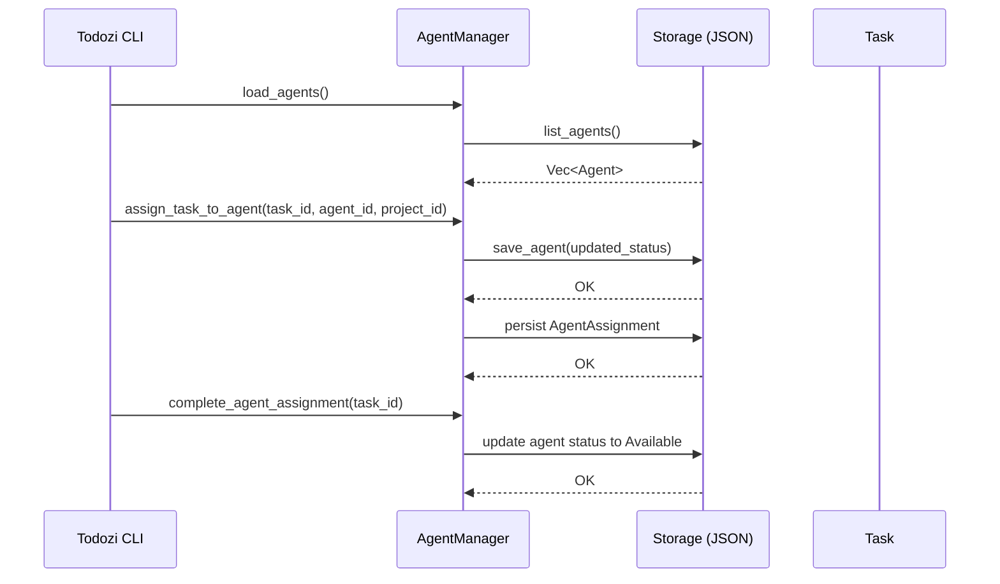

# Todozi

Todozi is a task management system designed from the ground up for human-AI collaboration. Unlike traditional project tools that treat AI as an afterthought, Todozi structures everything—tasks, memories, ideas—in semantically rich JSON that both humans and machines understand naturally. It provides hierarchical task decomposition (project → module → class → method chunks), specialized AI agent assignments, and rich metadata that enables intelligent decision-making at every level.

The system's superpower is semantic understanding. Every task and note is converted into meaning vectors using embeddings, unlocking intelligent features: find work by concept rather than keywords, automatically cluster related items, detect when project scope has drifted, and get AI-powered recommendations for what to do next. The embedding engine includes smart LRU caching, hybrid search combining semantics with keyword filtering. Critically, it's not static—Todozi logs all embeddings, exports data for fine-tuning, and lets you upgrade models over time as your project matures.

Collaboration happens through shared context: a memory system where AI recalls decisions and preferences, idea management for brainstorms, and conversational task extraction that lets you chat naturally with the system using simple markup tags (<todozi>, <memory>, <idea>) to create structured work. The AI never forgets, stays transparent about what it knows, and can be corrected like any team member. Available via CLI, optional Terminal UI with real-time charts and similarity graphs, or REST API—Todozi works in your development environment, whether local or distributed across a team.

### Top‑level commands (`Commands` enum)

| Command | Description / Sub‑commands |
|---------|----------------------------|
| **Init** | Initialise a Todozi folder structure |
| **Add** | Add resources – currently only `task` (see sub‑command) |
| **List** | List resources – currently only `tasks` |
| **Show** | Show a single resource – currently only `task` |
| **Update** | Update a task (many optional flags) |
| **Complete** | Mark a task as completed |
| **FixConsistency** | Repair task‑data consistency |
| **CheckStructure** | Verify the Todozi folder structure |
| **EnsureStructure** | Create missing folder components |
| **Register** | Register the client with the Todozi server (`--server-url`) |
| **RegistrationStatus** | Show current registration state |
| **ClearRegistration** | Remove stored registration data |
| **Delete** | Delete a task (`id`) |
| **Project** | Project‑related actions (see sub‑commands) |
| **Search** | Search resources (currently only `tasks`) |
| **Stats** | Show statistics (currently only `show`) |
| **Backup** | Create a backup (`create`) |
| **ListBackups** | List existing backups |
| **Restore** | Restore a named backup |
| **Memory** | Memory management (see sub‑commands) |
| **Idea** | Idea management (see sub‑commands) |
| **Agent** | Agent management (see sub‑commands) |
| **Emb** | Embedding‑service management (see sub‑commands) |
| **Error** | Error tracking (see sub‑commands) |
| **Train** | Training‑data handling (see sub‑commands) |
| **Chat** | Process a chat message |
| **SearchAll** | Unified search across all content types |
| **Maestro** | Maestro‑type orchestration (see sub‑commands) |
| **Server** | Server control (`start`, `status`, `endpoints`) |
| **ML** | Machine‑learning utilities (see sub‑commands) |
| **IndDemo** | Run the “individual demo” (placeholder) |
| **Queue** | Queue workflow (see sub‑commands) |
| **Api** | API‑key management (see sub‑commands) |
| **TdzCnt** | Process Todozi‑formatted content (`tdz_cnt`) |
| **ExportEmbeddings** | Export task embeddings to an HLX file |
| **Migrate** | Run the migration tool (`dry_run`, `verbose`, `force`, `cleanup`) |
| **Tui** | Launch the terminal UI |
| **Extract** | Extract tasks/memories/ideas from text or a file |
| **Strategy** | Run a strategic analysis on supplied content |

---

### Sub‑commands (selected groups)

| Parent command | Sub‑commands |
|----------------|--------------|
| **Add** | `task` – create a new task with fields `action`, `time`, `priority`, `project`, `status`, `assignee`, `tags`, `dependencies`, `context`, `progress`. |
| **List** | `tasks` – filter by `project`, `status`, `priority`, `assignee`, `tags`, `search`. |
| **Show** | `task {id}` – display a single task. |
| **Project** | `create`, `list`, `show`, `archive`, `delete`, `update`. |
| **Search** | `tasks {query}` – keyword search for tasks. |
| **Stats** | `show` – display overall statistics. |
| **Backup** | `create` – make a new backup file. |
| **Memory** | `create`, `create-secret`, `create-human`, `create-emotional`, `list`, `show`, `types`. |
| **Idea** | `create`, `list`, `show`. |
| **Agent** | `list`, `show`, `create`, `assign`, `update`, `delete`. |
| **Emb** | `set-model`, `show-model`, `list-models`. |
| **Error** | `create`, `list`, `show`, `resolve`, `delete`. |
| **Train** | `create`, `list`, `show`, `stats`, `export`, `collect`, `update`, `delete`. |
| **Maestro** | `init`, `collect-conversation`, `collect-tool`, `list`, `stats`, `export`, `integrate`. |
| **Server** | `start`, `status`, `endpoints`. |
| **ML** | `process`, `train`, `list`, `show`, `load`, `save`, `test`, `generate-training-data`, `advanced-process`, `advanced-train`, `advanced-infer`. |
| **Queue** | `plan`, `list`, `backlog`, `active`, `complete`, `start`, `end`. |
| **Api** | `register`, `list`, `check`, `deactivate`, `activate`, `remove`. |

---

# Todozi Commands Reference

This document provides a comprehensive reference for all Todozi CLI commands and their usage.

## 📋 Basic Operations

### Initialize System
```bash
todozi init
```
Initializes the Todozi system by creating the `~/.todozi/` directory structure and default configuration.

### Add Task
```bash
todozi add task <action> [options]
```

**Required Arguments:**
- `<action>` - Task description

**Options:**
- `-t, --time <time>` - Time estimate (e.g., "2 hours", "1 day")
- `--priority <priority>` - Priority level (low/medium/high/critical/urgent)
- `--project <project>` - Project name to associate with task
- `-s, --status <status>` - Status (todo/in_progress/completed/cancelled) [default: todo]
- `-u, --assignee <assignee>` - Assignee (ai/human/collaborative or specific agent)
- `--tags <tags>` - Comma-separated tags for the task
- `--dependencies <dependencies>` - Comma-separated task IDs this task depends on
- `-c, --context <context>` - Additional context or notes
- `-p, --progress <progress>` - Progress percentage (0-100)

**Example:**
```bash
todozi add task "Fix the login bug" --time "2 hours" --priority high --project webapp
```

### List Tasks
```bash
todozi list tasks [options]
```

**Options:**
- `-j, --project <project>` - Filter by project name
- `--status <status>` - Filter by status (todo/in_progress/completed/cancelled)
- `--priority <priority>` - Filter by priority (low/medium/high/critical/urgent)
- `-u, --assignee <assignee>` - Filter by assignee
- `-g, --tags <tags>` - Filter by tags (comma-separated)
- `-s, --search <search>` - Search in task descriptions

**Example:**
```bash
todozi list tasks --project webapp --status todo --priority high
```

### Show Task Details
```bash
todozi show task <id>
```

**Required Arguments:**
- `<id>` - Task ID to display

### Update Task
```bash
todozi update [options] <id>
```

**Required Arguments:**
- `<id>` - Task ID to update

**Options:**
- `-a, --action <action>` - Updated task description
- `-t, --time <time>` - Updated time estimate
- `-r, --priority <priority>` - Updated priority level
- `-j, --project <project>` - Updated project name
- `-s, --status <status>` - Updated status
- `-u, --assignee <assignee>` - Updated assignee
- `-g, --tags <tags>` - Updated tags (comma-separated)
- `-d, --dependencies <dependencies>` - Updated dependencies (comma-separated task IDs)
- `-c, --context <context>` - Updated context or notes
- `-p, --progress <progress>` - Updated progress percentage (0-100)

**Example:**
```bash
todozi update task_12345 --status in_progress --progress 50
```

### Complete Task
```bash
todozi complete <id>
```

**Required Arguments:**
- `<id>` - Task ID to mark as completed

### Delete Task
```bash
todozi delete <id>
```

**Required Arguments:**
- `<id>` - Task ID to delete

## 📁 Project Management

### Create Project
```bash
todozi project create <name> [options]
```

**Required Arguments:**
- `<name>` - Project name

**Options:**
- `-d, --description <description>` - Project description

### List Projects
```bash
todozi project list
```

### Show Project Details
```bash
todozi project show <name>
```

**Required Arguments:**
- `<name>` - Project name

### Archive Project
```bash
todozi project archive <name>
```

**Required Arguments:**
- `<name>` - Project name

### Update Project
```bash
todozi project update <name> [options]
```

**Required Arguments:**
- `<name>` - Project name

**Options:**
- `-n, --new-name <new-name>` - New project name
- `-d, --description <description>` - Updated description
- `-s, --status <status>` - Updated status

### Delete Project
```bash
todozi project delete <name>
```

**Required Arguments:**
- `<name>` - Project name

## 🤖 Agent Management

### List Agents
```bash
todozi agent list
```

### Show Agent Details
```bash
todozi agent show <id>
```

**Required Arguments:**
- `<id>` - Agent ID

### Create Enhanced Agent
```bash
todozi agent create [options] <id> <name> <description>
```

**Required Arguments:**
- `<id>` - Agent ID
- `<name>` - Agent name
- `<description>` - Agent description

**Options:**
- `-c, --category <category>` - Agent category (technical/creative/management/general) [default: general]
- `--capabilities <capabilities>` - Comma-separated list of capabilities
- `-s, --specializations <specializations>` - Comma-separated list of specializations
- `-p, --model-provider <model-provider>` - Model provider [default: todozi]
- `--model-name <model-name>` - Model name [default: baton]
- `--temperature <temperature>` - Model temperature [default: 0.2]
- `--max-tokens <max-tokens>` - Maximum tokens [default: 4096]
- `--tags <tags>` - Comma-separated tags
- `--system-prompt <system-prompt>` - Custom system prompt
- `--prompt-template <prompt-template>` - Custom prompt template
- `--auto-format-code <auto-format-code>` - Auto-format code (true/false)
- `--include-examples <include-examples>` - Include examples (true/false)
- `--explain-complexity <explain-complexity>` - Explain complexity (true/false)
- `--suggest-tests <suggest-tests>` - Suggest tests (true/false)
- `--tools <tools>` - Comma-separated list of tools
- `--max-response-length <max-response-length>` - Maximum response length
- `--timeout-seconds <timeout-seconds>` - Timeout in seconds
- `--requests-per-minute <requests-per-minute>` - Requests per minute
- `--tokens-per-hour <tokens-per-hour>` - Tokens per hour

### Update Agent
```bash
todozi agent update [options] <id>
```

**Required Arguments:**
- `<id>` - Agent ID

**Options:**
- `-n, --name <name>` - Updated agent name
- `-d, --description <description>` - Updated description
- `-c, --category <category>` - Updated category
- `--capabilities <capabilities>` - Updated capabilities
- `-s, --specializations <specializations>` - Updated specializations
- `--system-prompt <system-prompt>` - Updated system prompt
- `--prompt-template <prompt-template>` - Updated prompt template
- `-p, --model-provider <model-provider>` - Updated model provider
- `--model-name <model-name>` - Updated model name
- `--temperature <temperature>` - Updated temperature
- `--max-tokens <max-tokens>` - Updated maximum tokens
- `--tags <tags>` - Updated tags
- `--auto-format-code <auto-format-code>` - Updated auto-format code setting
- `--include-examples <include-examples>` - Updated include examples setting
- `--explain-complexity <explain-complexity>` - Updated explain complexity setting
- `--suggest-tests <suggest-tests>` - Updated suggest tests setting
- `--tools <tools>` - Updated tools
- `--max-response-length <max-response-length>` - Updated maximum response length
- `--timeout-seconds <timeout-seconds>` - Updated timeout
- `--requests-per-minute <requests-per-minute>` - Updated requests per minute
- `--tokens-per-hour <tokens-per-hour>` - Updated tokens per hour

### Delete Agent
```bash
todozi agent delete <id>
```

**Required Arguments:**
- `<id>` - Agent ID

### Assign Task to Agent
```bash
todozi agent assign <agent_id> <task_id> <project_id>
```

**Required Arguments:**
- `<agent_id>` - Agent ID
- `<task_id>` - Task ID
- `<project_id>` - Project ID

## 🧠 Memory Management

### List Memories
```bash
todozi memory list [options]
```

**Options:**
- `-r, --importance <importance>` - Filter by importance (low/medium/high)
- `-t, --term <term>` - Filter by term (short/medium/long)
- `-T, --memory-type <memory-type>` - Filter by memory type

### Create Memory
```bash
todozi memory create [options] <moment> <meaning> <reason>
```

**Required Arguments:**
- `<moment>` - What happened
- `<meaning>` - What it means
- `<reason>` - Why it matters

**Options:**
- `-r, --importance <importance>` - Importance level (low/medium/high) [default: medium]
- `-t, --term <term>` - Term (short/medium/long) [default: short]
- `-T, --memory-type <memory-type>` - Memory type (standard/secret/human/emotional) [default: standard]
- `-g, --tags <tags>` - Comma-separated tags
- `--emotion <emotion>` - Emotion (for emotional memories)

**Examples:**
```bash
# Standard memory
todozi memory create "User prefers dark mode" "UI customization preference" "Important for user experience" --importance high --term long

# Emotional memory
todozi memory create "User was frustrated with login" "Negative experience with authentication" "Need to improve UX" --importance high --term short --emotion frustration
```

### Show Memory Details
```bash
todozi memory show <id>
```

**Required Arguments:**
- `<id>` - Memory ID

### Create Secret Memory
```bash
todozi memory create-secret [options] <moment> <meaning> <reason>
```

**Required Arguments:**
- `<moment>` - What happened
- `<meaning>` - What it means
- `<reason>` - Why it matters

**Options:**
- `-r, --importance <importance>` - Importance level (low/medium/high) [default: medium]
- `-t, --term <term>` - Term (short/medium/long) [default: short]
- `-g, --tags <tags>` - Comma-separated tags

### Create Human Memory
```bash
todozi memory create-human [options] <moment> <meaning> <reason>
```

**Required Arguments:**
- `<moment>` - What happened
- `<meaning>` - What it means
- `<reason>` - Why it matters

**Options:**
- `-r, --importance <importance>` - Importance level (low/medium/high) [default: high]
- `-t, --term <term>` - Term (short/medium/long) [default: long]
- `-g, --tags <tags>` - Comma-separated tags

### Create Emotional Memory
```bash
todozi memory create-emotional [options] <moment> <meaning> <reason> <emotion>
```

**Required Arguments:**
- `<moment>` - What happened
- `<meaning>` - What it means
- `<reason>` - Why it matters
- `<emotion>` - Emotion type

**Options:**
- `-r, --importance <importance>` - Importance level (low/medium/high) [default: medium]
- `-t, --term <term>` - Term (short/medium/long) [default: short]
- `-g, --tags <tags>` - Comma-separated tags

## 💡 Idea Management

### List Ideas
```bash
todozi idea list [options]
```

**Options:**
- `-s, --share <share>` - Filter by share setting (private/public)
- `-r, --importance <importance>` - Filter by importance (low/medium/high)

### Create Idea
```bash
todozi idea create [options] <idea>
```

**Required Arguments:**
- `<idea>` - Idea description

**Options:**
- `-s, --share <share>` - Share setting (private/public) [default: private]
- `-r, --importance <importance>` - Importance level (low/medium/high) [default: medium]
- `-g, --tags <tags>` - Comma-separated tags
- `-c, --context <context>` - Additional context

### Show Idea Details
```bash
todozi idea show <id>
```

**Required Arguments:**
- `<id>` - Idea ID

## 🔍 Search and Filtering

### Search Tasks
```bash
todozi search tasks <query>
```

**Required Arguments:**
- `<query>` - Search query

### Search All Content
```bash
todozi search-all [options] <query>
```

**Required Arguments:**
- `<query>` - Search query

**Options:**
- `-t, --types <types>` - Data types to search (tasks,memories,ideas,errors) [default: tasks,memories,ideas,errors]

### Show Statistics
```bash
todozi stats show
```

## 💾 Backup and Restore

### Create Backup
```bash
todozi backup create
```

### List Backups
```bash
todozi list-backups
```

### Restore from Backup
```bash
todozi restore <backup_name>
```

**Required Arguments:**
- `<backup_name>` - Name of backup to restore

## 🧩 Code Chunking Management

### List Code Chunks
```bash
todozi chunk list [options]
```

**Options:**
- `-p, --project <project>` - Filter by project
- `-s, --status <status>` - Filter by status
- `-l, --level <level>` - Filter by chunking level

### Create Code Chunk
```bash
todozi chunk create [options] <file_path>
```

**Required Arguments:**
- `<file_path>` - Path to source file

**Options:**
- `-p, --project <project>` - Project name
- `-l, --level <level>` - Chunking level (file/function/class/block)
- `-c, --context <context>` - Additional context

### Show Chunk Details
```bash
todozi chunk show <id>
```

**Required Arguments:**
- `<id>` - Chunk ID

### Show Dependency Graph
```bash
todozi chunk graph [options]
```

**Options:**
- `-p, --project <project>` - Filter by project
- `-f, --format <format>` - Output format (text/dot/json)

### Show Ready Chunks
```bash
todozi chunk ready [options]
```

**Options:**
- `-p, --project <project>` - Filter by project

## 🤖 AI Enhancement Commands

### Extract Tasks from Content
```bash
todozi extract [options] [content]
```

**Arguments:**
- `[content]` - Inline text content to extract tasks from

**Options:**
- `-f, --file <file>` - File path to extract content from
- `-o, --output <output>` - Output format (json/csv/md) [default: json]
- `--human` - Generate human-readable markdown checklist file

### Strategic Planning
```bash
todozi strategy [options] [content]
```

**Arguments:**
- `[content]` - Inline text content to strategize from

**Options:**
- `-f, --file <file>` - File path to strategize content from
- `-o, --output <output>` - Output format (json/csv/md) [default: json]
- `--human` - Generate human-readable markdown checklist file

### Chat with Todozi
```bash
todozi chat <message>
```

**Required Arguments:**
- `<message>` - Chat message

### Process Error
```bash
todozi error create [options] <title> <description> <source>
```

**Required Arguments:**
- `<title>` - Error title
- `<description>` - Error description
- `<source>` - Error source

**Options:**
- `-s, --severity <severity>` - Severity level (low/medium/high/critical) [default: medium]
- `-c, --category <category>` - Error category (runtime/logic/config/network) [default: runtime]
- `-c, --context <context>` - Additional context
- `-g, --tags <tags>` - Comma-separated tags

### List Errors
```bash
todozi error list [options]
```

**Options:**
- `-s, --severity <severity>` - Filter by severity
- `-c, --category <category>` - Filter by category
- `-u, --unresolved-only` - Show only unresolved errors

### Show Error Details
```bash
todozi error show <id>
```

**Required Arguments:**
- `<id>` - Error ID

### Resolve Error
```bash
todozi error resolve <id> [resolution]
```

**Required Arguments:**
- `<id>` - Error ID

**Arguments:**
- `[resolution]` - Resolution description

### Delete Error
```bash
todozi error delete <id>
```

**Required Arguments:**
- `<id>` - Error ID

## 🚀 Queue Management

### Plan Task Queue
```bash
todozi queue plan [options]
```

**Options:**
- `-t, --task-name <task-name>` - Task name
- `-d, --task-description <task-description>` - Task description
- `-p, --priority <priority>` - Priority level (low/medium/high) [default: medium]
- `-j, --project-id <project-id>` - Project ID

### List Queue Items
```bash
todozi queue list [options]
```

**Options:**
- `-s, --status <status>` - Filter by status

### Show Backlog
```bash
todozi queue backlog
```

### Show Active Queue
```bash
todozi queue active
```

### Complete Queue
```bash
todozi queue complete
```

### Start Queue Item
```bash
todozi queue start <queue_item_id>
```

**Required Arguments:**
- `<queue_item_id>` - Queue item ID

### End Session
```bash
todozi queue end <session_id>
```

**Required Arguments:**
- `<session_id>` - Session ID

## 🧠 Training Data Management

### Create Training Data
```bash
todozi train create [options] <prompt> <completion>
```

**Required Arguments:**
- `<prompt>` - Prompt text
- `<completion>` - Completion text

**Options:**
- `-t, --data-type <data-type>` - Data type (instruction/chat/preference) [default: instruction]
- `-c, --context <context>` - Additional context
- `-g, --tags <tags>` - Comma-separated tags
- `-q, --quality <quality>` - Quality score (0.0-1.0)
- `-s, --source <source>` - Data source (manual/automatic) [default: manual]

### List Training Data
```bash
todozi train list [options]
```

**Options:**
- `-t, --data-type <data-type>` - Filter by data type
- `-q, --min-quality <min-quality>` - Minimum quality score

### Show Training Data
```bash
todozi train show <id>
```

**Required Arguments:**
- `<id>` - Training data ID

### Training Statistics
```bash
todozi train stats
```

### Export Training Data
```bash
todozi train export [options]
```

**Options:**
- `-f, --format <format>` - Export format (json/csv) [default: json]
- `-t, --data-type <data-type>` - Filter by data type
- `-q, --min-quality <min-quality>` - Minimum quality score
- `-o, --output-file <output-file>` - Output file path

### Collect Training Data
```bash
todozi train collect <message>
```

**Required Arguments:**
- `<message>` - Message to collect

### Update Training Data
```bash
todozi train update [options] <id>
```

**Required Arguments:**
- `<id>` - Training data ID

**Options:**
- `-t, --data-type <data-type>` - Updated data type
- `-p, --prompt <prompt>` - Updated prompt
- `-c, --completion <completion>` - Updated completion
- `--context <context>` - Updated context
- `--tags <tags>` - Updated tags
- `--quality <quality>` - Updated quality score

## 🔧 System Commands

### Check Structure
```bash
todozi check-structure
```

### Ensure Structure
```bash
todozi ensure-structure
```

### Fix Consistency
```bash
todozi fix-consistency
```

### Register with Server
```bash
todozi register [options]
```

**Options:**
- `-s, --server-url <server-url>` - Server URL [default: https://todozi.com]

### Check Registration Status
```bash
todozi registration-status
```

### Clear Registration
```bash
todozi clear-registration
```

### Launch TUI
```bash
todozi tui
```

### Launch Web UI
```bash
todozi web
```

## 🌐 API Management

### Register API User
```bash
todozi api register [options]
```

**Options:**
- `-u, --user-id <user-id>` - User ID

### List API Users
```bash
todozi api list [options]
```

**Options:**
- `-a, --active-only` - Show only active users

### Check API Key
```bash
todozi api check [options] <public_key>
```

**Required Arguments:**
- `<public_key>` - Public key

**Options:**
- `-p, --private-key <private-key>` - Private key

### Deactivate API User
```bash
todozi api deactivate <user_id>
```

**Required Arguments:**
- `<user_id>` - User ID

### Activate API User
```bash
todozi api activate <user_id>
```

**Required Arguments:**
- `<user_id>` - User ID

### Remove API User
```bash
todozi api remove <user_id>
```

**Required Arguments:**
- `<user_id>` - User ID

## 🧬 Embedding Management

### Set Embedding Model
```bash
todozi emb set-model <model_name>
```

**Required Arguments:**
- `<model_name>` - Model name from HuggingFace

### Show Current Embedding Model
```bash
todozi emb show-model
```

### List Popular Embedding Models
```bash
todozi emb list-models
```

## 📤 Data Export

### Export Embeddings
```bash
todozi export-embeddings [options]
```

**Options:**
- `-o, --output <output>` - Output file path [default: todozi_embeddings.hlx]

## 🔄 Migration

### Migrate Data
```bash
todozi migrate [options]
```

**Options:**
- `--dry-run` - Perform a dry run without making changes
- `-v, --verbose` - Enable verbose output
- `--force` - Force migration even if checks fail
- `--cleanup` - Clean up old collections after migration

## 🎭 Maestro Commands

### Initialize Maestro
```bash
todozi maestro init
```

### Collect Conversation
```bash
todozi maestro collect-conversation [options]
```

**Options:**
- `-s, --session-id <session-id>` - Session ID
- `-c, --conversation <conversation>` - Conversation data
- `-l, --context-length <context-length>` - Context length [default: 0]
- `-t, --tool-calls <tool-calls>` - Tool calls
- `-r, --response <response>` - Response data
- `-T, --response-time-ms <response-time-ms>` - Response time in milliseconds [default: 1000]

### Collect Tool Usage
```bash
todozi maestro collect-tool [options]
```

**Options:**
- `-s, --session-id <session-id>` - Session ID
- `-t, --tool-name <tool-name>` - Tool name
- `-c, --tool-call <tool-call>` - Tool call data
- `-T, --execution-time-ms <execution-time-ms>` - Execution time in milliseconds [default: 500]
- `-s, --success <success>` - Success status
- `-r, --result-summary <result-summary>` - Result summary

## 🤖 ML Commands

### Train Model
```bash
todozi ml train [options]
```

**Options:**
- `-d, --dataset <dataset>` - Dataset path
- `-m, --model <model>` - Model type
- `-e, --epochs <epochs>` - Number of epochs
- `-b, --batch-size <batch-size>` - Batch size

### Evaluate Model
```bash
todozi ml evaluate [options] <model_path>
```

**Required Arguments:**
- `<model_path>` - Path to model

**Options:**
- `-d, --dataset <dataset>` - Dataset path
- `-m, --metrics <metrics>` - Metrics to evaluate

### Deploy Model
```bash
todozi ml deploy [options] <model_path>
```

**Required Arguments:**
- `<model_path>` - Path to model

**Options:**
- `-e, --endpoint <endpoint>` - Deployment endpoint
- `-v, --version <version>` - Model version

## 🚨 Error Handling

### Task Not Found
When a task ID is not found, Todozi will display:
```
❌ Task not found: <task_id>
```

### Project Not Found
When a project name is not found, Todozi will display:
```
❌ Project not found: <project_name>
```

### Agent Not Found
When an agent ID is not found, Todozi will display:
```
❌ Agent not found: <agent_id>
```

### Invalid Priority/Status
When an invalid priority or status is provided, Todozi will display:
```
❌ Invalid priority/status: <value>
Valid options are: <list_of_valid_options>
```

### Invalid Assignee
When an invalid assignee is provided, Todozi will display:
```
❌ Invalid assignee: <value>
Valid options are: ai, human, collaborative, or a specific agent ID
```

## 💡 Tips and Best Practices

1. **Use Projects**: Organize tasks into projects for better management
2. **Set Priorities**: Always set appropriate priorities for tasks
3. **Add Context**: Provide context for complex tasks
4. **Use Tags**: Tag tasks for easier filtering and searching
5. **Regular Backups**: Create backups regularly to prevent data loss
6. **AI Collaboration**: Use AI agents for tasks that benefit from automation
7. **Memory Management**: Save important insights as memories for future reference
8. **Idea Capture**: Capture ideas immediately to prevent forgetting them
9. **Error Tracking**: Log errors to improve system reliability
10. **Training Data**: Contribute to model improvement by collecting training data


--- 


# Todozi Tags Reference

This document provides a formal list of all `<todozi>` tags and their required parameters that models would use to create tasks, memories, ideas, etc. Technically you could also in a tdzcnt active chat, but the cli and gui/tui are quicker. 

## Examples

### Tasks
`<todozi>Action; Time; Priority; Project; Status; assignee=human; tags=tag1,tag2</todozi>`
`<todozi>Fix login bug; 2 hours; high; authentication; in_progress; assignee=ai; tags=security,bug</todozi>`
`<todozi>Write API documentation; 6 hours; medium; backend; todo; assignee=human; tags=documentation,api</todozi>`
`<todozi>Design database schema; 8 hours; high; infrastructure; blocked; assignee=collaborative; tags=database,design</todozi>`
`<todozi>Implement user notifications; 4 hours; medium; frontend; todo; assignee=ai; tags=ux,notifications</todozi>`

### Agent Assignments
`<todozi_agent>task123; agent456; review_code; important</todozi_agent>`
`<todozi_agent>task789; ai_assistant; debug_error; urgent</todozi_agent>`
`<todozi_agent>task456; code_reviewer; quality_check; standard</todozi_agent>`
`<todozi_agent>task101; test_runner; validate_deployment; critical</todozi_agent>`
`<todozi_agent>task202; design_expert; ui_review; medium</todozi_agent>`

### Memories
`<memory>standard; What happened; What it means; Why it matters; high; long; tags</memory>`
`<memory>happy; Completed project milestone; Achievement feels great; Motivation for future work; high; long; success,productivity</memory>`
`<memory>secret; Private conversation details; Confidential information; Keep secure; critical; long; confidential</memory>`
`<memory>short; Quick reminder note; Temporary information; Will forget soon; low; short; temp</memory>`
`<memory>frustrated; API integration failed; Error handling is crucial; Always implement proper error handling; high; long; debugging,api</memory>`

### Ideas
`<idea>Idea content; share; importance; context; tags</idea>`
`<idea>Voice-controlled interface; team; high; Could revolutionize mobile UX; innovation,accessibility</idea>`
`<idea>AI-powered code reviews; public; breakthrough; Transform development workflow; ai,productivity</idea>`
`<idea>Real-time collaboration tools; team; medium; Improve team communication; collaboration,tools</idea>`
`<idea>Automated testing framework; private; high; Reduce manual testing time; development,qa</idea>`

### Code Chunks
`<chunk>id; level; description; dependencies; code</chunk>`
`<chunk>auth_module; module; User authentication system; user_model; class AuthManager</chunk>`
`<chunk>api_routes; class; REST API endpoints; auth_module; @app.route('/api/users')</chunk>`
`<chunk>db_connection; method; Database connection handler; config; def get_db_connection()</chunk>`
`<chunk>error_handler; block; Global error handling; logging; try: ... except Exception</chunk>`

### Errors
`<error>title; description; severity; category; source; context; tags</error>`
`<error>Database connection failed; Connection timeout after 30 seconds; critical; database; db_service; Check connection pool settings; database,timeout</error>`
`<error>API authentication error; Invalid JWT token format; high; security; auth_middleware; Implement token validation; security,jwt</error>`
`<error>Memory leak detected; Application memory usage growing; medium; performance; memory_manager; Add garbage collection; performance,memory</error>`
`<error>File upload failed; File size exceeds limit; low; validation; upload_handler; Increase file size limit; upload,validation</error>`

### Training Data
`<train>data_type; prompt; completion; context; tags; quality_score; source</train>`
`<train>instruction; Write a hello world function; def hello_world(): return "Hello, World!"; Basic Python syntax; python,basics; 0.95; tutorial</train>`
`<train>code_example; Implement binary search; def binary_search(arr, target): ...; Algorithm implementation; algorithms,search; 0.9; leetcode</train>`
`<train>conversation; How to handle errors; Use try-except blocks and log errors; Error handling best practices; python,errors; 0.85; documentation</train>`
`<train>completion; Complete the SQL query; SELECT * FROM users WHERE; SELECT * FROM users WHERE active = 1; Database queries; sql,database; 0.8; examples</train>`

### Feelings
`<feel>emotion; intensity; description; context; tags</feel>`
`<feel>excited; 9; Just launched the new feature successfully!; product launch; achievement,success</feel>`
`<feel>frustrated; 7; Bug took 3 hours to find and fix; debugging session; debugging,patience</feel>`
`<feel>confident; 8; Code review went perfectly; team collaboration; leadership,communication</feel>`
`<feel>overwhelmed; 6; Too many tasks, need to prioritize; project planning; organization,time-management</feel>`
`<feel>proud; 9; Team delivered ahead of schedule; project completion; teamwork,achievement</feel>`

### Summaries
`<summary>content; priority; context; tags</summary>`
`<summary>Successfully deployed v2.0 with zero downtime; critical; Major milestone achieved; deployment,success,reliability</summary>`
`<summary>Completed user testing phase; high; Gathered valuable feedback; testing,user-research,ux</summary>`
`<summary>Security audit passed with no issues; high; System security validated; security,compliance</summary>`
`<summary>Team productivity increased 25%; medium; Process improvements working; productivity,metrics</summary>`

### Reminders
`<reminder>content; remind_at; priority; status; tags</reminder>`
`<reminder>Team standup meeting; 2025-01-17T09:00:00Z; high; pending; meeting,daily,team</reminder>`
`<reminder>Submit quarterly report; 2025-01-31T17:00:00Z; medium; pending; reporting,deadline</reminder>`
`<reminder>Code review for pull request #123; 2025-01-18T14:00:00Z; high; pending; code-review,development</reminder>`
`<reminder>Client presentation preparation; 2025-01-20T10:00:00Z; critical; pending; presentation,client</reminder>`

### System Responses
`<tdz_sys>content</tdz_sys>`
`<tdz_sys>Great job! I've processed the following items: • Task: Implement user login • Memory: First successful deployment</tdz_sys>`
`<tdz_sys>System maintenance scheduled for tonight at 2 AM UTC</tdz_sys>`
`<tdz_sys>Backup completed successfully - 1.2GB data archived</tdz_sys>`
`<tdz_sys>Security scan found 3 vulnerabilities requiring attention</tdz_sys>`

### General Tdz Tags
`<tdz>content</tdz>`
`<tdz>Process this message and extract all relevant todozi tags</tdz>`
`<tdz>Analyze project requirements and create implementation plan</tdz>`
`<tdz>Review code quality and suggest improvements</tdz>`
`<tdz>Generate documentation for the new API endpoints</tdz>`

### Shorthand Tags
`<tz>Fix critical bug in authentication; 2h; urgent; security; in_progress</tz>`
`<mm>frustrated; Debug session took 4 hours; Need better error logging; medium; long; debugging,productivity</mm>`
`<id>Implement dark mode toggle; team; medium; Improve user experience; ux,accessibility</id>`
`<ch>auth_service; module; User authentication and authorization; user_model,database; class AuthService</ch>`
`<fe>excited; 8; Just got approval for the new feature release!; product meeting; success,teamwork</fe>`
`<tn>instruction; Write a REST API endpoint; @app.route('/api/users', methods=['GET']); API development; python,flask; 0.9; tutorial</tn>`
`<er>Database timeout; Connection pool exhausted; critical; database; db_handler; Increase pool size; performance,database</er>`
`<sm>Weekly sprint completed ahead of schedule; high; Team velocity increased 15%; agile,success</sm>`
`<rd>Team retrospective meeting; 2025-01-19T15:00:00Z; medium; pending; retrospective,team</rd>`

## Task Tags

### `<todozi>` - Task Definition
**Required Parameters (minimum 5):**
- `action` (string) - The task description/action to perform
- `time` (string) - Time estimate or deadline
- `priority` (enum: low, medium, high, critical) - Task priority level
- `parent_project` (string) - Project this task belongs to
- `status` (enum: todo, in_progress, done, blocked, deferred) - Current task status

**Optional Parameters:**
- `assignee` (enum: human, ai, collaborative, agent:{name}) - Who should execute this task
- `tags` (comma-separated strings) - Task tags for categorization
- `dependencies` (comma-separated strings) - Task IDs this task depends on
- `context_notes` (string) - Additional context or notes
- `progress` (integer 0-100) - Completion percentage

**Example:**
```xml
<todozi>Implement OAuth2 login flow; 6 hours; high; python-web-framework; todo; assignee=human; tags=auth,backend; dependencies=Design API; context_notes=Ensure security; progress=0%</todozi>
```

### `<todozi_agent>` - Agent Assignment
**Required Parameters (minimum 3):**
- `agent_id` (string) - Identifier of the agent to assign
- `task_id` (string) - ID of the task to assign
- `project_id` (string) - ID of the project

**Example:**
```xml
<todozi_agent>task123; agent456; review_code; important</todozi_agent>
```

## Memory Tags

### `<memory>` - Unified Memory (All Types)
**Required Parameters (minimum 6):**
- `type` (string/enum: standard, secret, human, short, long, or emotion name) - Memory type
- `moment` (string) - What happened
- `meaning` (string) - What it means
- `reason` (string) - Why it matters
- `importance` (enum: low, medium, high, critical) - Importance level
- `term` (enum: short, long) - Memory retention term

**Optional Parameters:**
- `tags` (comma-separated strings) - Memory tags

**Memory Types:**
- `standard` - General memory
- `secret` - Sensitive/private memory
- `human` - Human-related memory
- `short` - Short-term memory (term automatically set to short)
- `long` - Long-term memory (term automatically set to long)
- Emotion names: `happy`, `sad`, `angry`, `fearful`, `surprised`, `disgusted`, `excited`, `anxious`, `confident`, `frustrated`, `motivated`, `overwhelmed`, `curious`, `satisfied`, `disappointed`, `grateful`, `proud`, `ashamed`, `hopeful`, `resigned`

**Examples:**
```xml
<memory>standard; First insight; This is an important insight; High value information; high; long; insight,valuable</memory>
<memory>secret; Private conversation; Confidential information; Need to keep secure; high; long; confidential</memory>
<memory>happy; Completed project milestone; Feels great to accomplish goals; Motivation boost; high; long; achievement,success</memory>
<memory>short; Temporary note; Quick reminder; Will forget soon; low; short; temp</memory>
```

## Idea Tags

### `<idea>` - Idea Capture
**Required Parameters (minimum 3):**
- `idea` (string) - The idea content
- `share` (enum: share/dont share/don't share/private/team) - Sharing level
- `importance` (enum: low, medium, high, critical) - Idea importance

**Example:**
```xml
<idea>Revolutionary approach; high; This could change everything</idea>
```

## Code Chunking Tags

### `<chunk>` - Code Chunk Definition
**Required Parameters (minimum 3):**
- `id` (string) - Unique chunk identifier
- `level` (enum: project, module, class, method, block) - Chunking level
- `description` (string) - Description of the chunk

**Optional Parameters:**
- `dependencies` (comma-separated strings) - Chunk dependencies
- `code` (string) - Actual code content

**Example:**
```xml
<chunk>chunk1; module; Create database handler; chunk0; import sqlite3</chunk>
```

## Error Tags

### `<error>` - Error Logging
**Required Parameters (minimum 5):**
- `title` (string) - Error title
- `description` (string) - Error description
- `severity` (enum: low, medium, high, critical) - Error severity
- `category` (enum: network, database, security, performance, logic, configuration, external_service) - Error category
- `source` (string) - Error source/component

**Optional Parameters:**
- `context` (string) - Additional context
- `tags` (comma-separated strings) - Error tags

**Example:**
```xml
<error>Database connection failed; Unable to connect to PostgreSQL database; critical; network; database-service; Connection timeout after 30 seconds; database,postgres,connection</error>
```

## Training Data Tags

### `<train>` - Training Data
**Required Parameters (minimum 4):**
- `data_type` (enum: instruction, completion, conversation, code_example) - Type of training data
- `prompt` (string) - The prompt/input
- `completion` (string) - The completion/output
- `context` (string) - Context information

**Optional Parameters:**
- `tags` (comma-separated strings) - Training data tags
- `quality_score` (float 0.0-1.0) - Quality score
- `source` (string) - Data source

**Example:**
```xml
<train>instruction; Write a function to calculate fibonacci numbers; def fibonacci(n):\n    if n <= 1:\n        return n\n    return fibonacci(n-1) + fibonacci(n-2); Python programming example; python,algorithm,recursion; 0.9; code-examples</train>
```

## Feeling Tags

### `<feel>` - Emotional State
**Required Parameters (minimum 3):**
- `emotion` (string) - Emotion name
- `intensity` (integer 1-10) - Emotion intensity
- `description` (string) - Description of the feeling

**Optional Parameters:**
- `context` (string) - Context where feeling occurred
- `tags` (comma-separated strings) - Feeling tags

**Example:**
```xml
<feel>excited; 9; Making great progress on this project!; coding session; productive,happy</feel>
```

## Summary Tags

### `<summary>` - Content Summary
**Required Parameters (minimum 2):**
- `content` (string) - Summary content
- `priority` (enum: low, medium, high, critical) - Summary priority

**Optional Parameters:**
- `context` (string) - Additional context
- `tags` (comma-separated strings) - Summary tags

**Example:**
```xml
<summary>Project completed successfully; high; Final project delivery; project,completion,success</summary>
```

## Reminder Tags

### `<reminder>` - Reminder Setting
**Required Parameters (minimum 3):**
- `content` (string) - Reminder content
- `remind_at` (ISO 8601 datetime) - When to remind
- `priority` (enum: low, medium, high, critical) - Reminder priority

**Optional Parameters:**
- `status` (enum: pending, active, completed, cancelled) - Reminder status (default: pending)
- `tags` (comma-separated strings) - Reminder tags

**Example:**
```xml
<reminder>Team meeting at 3 PM; 2025-01-17T15:00:00Z; high; pending; meeting,team</reminder>
```

## Shorthand Tags

The following shorthand tags are automatically transformed to their full forms:

- `<tz>` → `<todozi>`
- `<mm>` → `<memory>`
- `<id>` → `<idea>`
- `<ch>` → `<chunk>`
- `<fe>` → `<feel>`
- `<tn>` → `<train>`
- `<er>` → `<error>`
- `<sm>` → `<summary>`
- `<rd>` → `<reminder>`
- `<tdz>` → `<tdz>` (appears to be a duplicate)

## Parameter Format

All tags use semicolon (`;`) as parameter separators. Parameters should be trimmed of whitespace. Optional parameters that are empty or missing will use default values or be set to `None`.

## Validation

Each tag has minimum parameter requirements. If these are not met, parsing will fail with a validation error indicating what's missing.

--- 

# Todozi: AI-HU Task Manager

## Introduction and System Overview

Todozi is an AI-first task management system that tightly integrates human workflows with AI assistance. It
provides a **file-based** core (using JSON storage) for portability and simplicity, along with a rich set of
features for project and task organization. The system is built to facilitate **AI/Human collaboration**
at every level, from **structured task metadata** optimized for machine understanding to dedicated agent
assignments and an **AI memory/idea system** for shared context. Todozi can be used via a command-
line interface (CLI) and an optional Terminal User Interface (TUI) locally, or as a networked service with a
REST API – making it accessible to virtually any programming environment. 

At a high level, Todozi’s design emphasizes **AI extensibility** and structured data. Tasks, ideas, and
memories are stored in well-defined JSON schemas to be easily parsed and used by AI models. The system
uses **semantic embeddings** to enable intelligent task search and recommendations beyond keyword
matching. A dedicated **embedding service** manages model loading, caching, and vector search
operations. Todozi also incorporates a pipeline for **continuous model improvement** : collecting embedding
data, exporting it for fine-tuning, and supporting model versioning and drift detection to ensure quality
over time. Human users and AI agents collaborate through shared **context and memory** features –
for example, AI can recall project-specific notes or prior decisions via a memory subsystem , and
tasks can be extracted from natural conversation with the AI. Finally, Todozi offers an interactive
**Terminal UI** that presents tasks, analytics, and AI insights in a unified interface for efficient local operation.
In the following sections, we explore each of these core areas in detail:

```
AI-Integrated Task Management – how Todozi structures tasks, projects, and agents to enable AI
involvement (metadata, assignments, hierarchical tasks).
Embedding and Semantic Search System – the internal embedding infrastructure, including
caching, semantic/hybrid search, clustering, recommendations, and drift detection.
Model Training and Enhancement Pipeline – how embedding models are managed and improved
over time (versioning, fine-tuning exports, validation).
Human-AI Collaboration Features – memory and idea systems, shared context between humans
and AI, and conversational task extraction.
Terminal User Interface (TUI) – design and capabilities of Todozi’s TUI for interactive task
management and visualization.
```
Throughout the paper, code snippets and examples illustrate the implementation, and real-world use cases
demonstrate how these features come together to support AI-augmented project management.

## AI-Integrated Task Management

Todozi’s task management is designed from the ground up to accommodate both human users and AI
agents working in tandem. At its core is a **structured task model** with rich metadata fields, enabling both
fine-grained organization and machine readability. The **Task** structure (v1.2.0) includes fields such as unique
ID, action (description), time estimate or deadline, priority, project association, status, assignee, tags,
dependencies, context notes, progress, and timestamps. This comprehensive schema captures all
relevant information about a task in a structured format. Notably, many fields are optional but standardized

- for example, tasks can include an **assignee** indicating whether it’s assigned to a human, an AI, a
collaborative effort, or a specific AI agent role. Tasks may also list **dependencies** (by referencing other
task IDs) to express prerequisite relationships, and **tags** which serve for categorization and filtering.
This rich metadata not only helps human project managers but is also **optimized for AI processing** , as the
structured JSON format can be easily serialized for model training or inference.

**Agent Assignment:** Todozi extends the concept of task ownership beyond just “human” or “AI” – it supports
specialized **AI agents** that can be assigned to tasks. The system comes with default agent roles such as
_Planner_ , _Coder_ , _Tester_ , _Designer_ , and _DevOps_ , each intended for specific domains of work. A task’s
assignee can be set as agent:<role> (e.g., agent:planner) to designate it to a specialized AI agent.
Through the CLI, users can directly assign tasks to agents or switch assignees: e.g. todozi assign
<task_id> --assignee ai to assign to the general AI, or --assignee agent:planner for a specific
planner agent. Under the hood, _Assignee_ is an enum that includes Ai , Human, Collaborative (for
tasks jointly handled by AI and human), as well as agent identifiers for specialized AI roles. This mechanism
allows dividing work based on expertise – for instance, a “Coder” agent might handle programming tasks
while a “Tester” agent focuses on QA tasks. The Todozi task list can be filtered by assignee to see which
tasks are allocated to which agent or human (e.g., todozi list --assignee agent:planner to list all
planning tasks). By tracking assignees in a structured way, Todozi enables clarity in AI-human
responsibilities and supports downstream logic where agents can pick up tasks relevant to their role.

**Hierarchical Task Decomposition:** A standout feature of Todozi is how it supports breaking down complex
projects into smaller tasks or “chunks” in a hierarchical fashion – a capability particularly useful when AI
agents are involved in planning or coding tasks. Todozi implements a _chunking system_ that allows tasks to
be decomposed into multiple levels (project, module, class, method, block) with parent-child relationships

. This was originally introduced to help an AI (e.g., a coding assistant) manage large coding projects
by splitting them into bite-sized pieces. For example, a high-level project idea can be captured as a “project”
chunk, which may be broken into several “module” chunks, each of which contains “class” or “method”
chunks, and so on. Each chunk is identified by an ID and declares its level and an optional list of
dependencies (other chunks it depends on). Todozi tracks these dependencies and can determine which
chunks are “ready” (all prerequisites satisfied) so that AI agents focus on those first. In essence, this
creates a dynamic task graph that the AI can navigate. The hierarchical decomposition enforces **token
limits per level** (e.g., descriptions for project-level chunks are kept short, method-level chunks can have
more detail) to ensure that each piece stays within manageable size for LLM context windows. This
structured breakdown vastly improves AI efficiency and scalability: the AI can maintain context at each level
without being overwhelmed by the entire project at once. In real-world use, an AI _Planner_ could
create a project plan of chunks, and a _Coder_ agent could then implement each code chunk sequentially,
preserving context and respecting dependencies. Todozi’s CLI and API support chunk management via
commands like todozi chunk list, todozi chunk graph (to visualize dependency graph), and
todozi chunk ready (to list ready-to-work chunks). This hierarchical task model not only mirrors how human teams break projects into subtasks, but it also aligns with AI constraints, making Todozi
particularly suitable for large projects involving AI co-workers.

**Rich Task Metadata for AI:** Every task in Todozi carries metadata that is leveraged to improve AI
interactions. **Priority** and **Status** fields are enumerated types (e.g., Priority can be Low/Medium/High/
Critical/Urgent; Status can be Todo, InProgress, Blocked, Review, Done, etc.). These structured fields
allow an AI agent to prioritize actions (e.g., focusing on _urgent_ tasks first) and to understand the state of
each task in a predictable way. The optional **context_notes** field provides additional natural language
context or instructions for the task, which an AI agent can use to get more background or guidelines.
The **progress** field (0-100%) can be used to track partial completion of tasks, enabling AI to report how far
along a task is (or even for an AI to update progress as it works). Because Todozi uses JSON for storage,
an AI model fine-tuned on Todozi data can easily parse these fields. The **AI-first design** ensures that, for
example, tasks added via natural language input are immediately structured in JSON with all these fields
populated, so they can be fed into language models or embedding models for further reasoning. In
practice, a developer might say, “Implement user login; 3 days; high priority; project=website; status=todo;
assignee=AI,” and Todozi would store this as a structured task that an AI agent can pick up. The structured
metadata also makes it straightforward to perform bulk analysis – e.g., calculating how many tasks are
assigned to AI vs humans, or how many high-priority tasks remain open.

**Project and Organization:** Todozi supports multiple projects, each essentially acting as a namespace or
collection for tasks. Projects are stored in separate JSON files (e.g., ~/.todozi/projects/
myproject.json for a project named "myproject"). This separation aids both humans and AI by
providing contextual boundaries – an AI agent could filter its operations to a single project to avoid
confusion with tasks from other projects. The CLI offers project management commands to create, list,
archive, or delete projects. Tasks themselves carry a parent_project field linking them to their
project. This ensures that when the AI or search system is asked about tasks, it can organize responses
per project. Additionally, Todozi maintains global lists for active, completed, and archived tasks under the
tasks/ directory for quick access to tasks by status category. The combination of project grouping
and status grouping allows flexible querying (e.g., list all active tasks across projects, or list all tasks in
project X that are blocked). AI agents can be aware of this structure; for instance, a _Planner_ agent might first
ensure a project exists, then populate it with tasks, and a _DevOps_ agent might archive a project when it’s
completed.

**Use Case Example:** Consider a software development team using Todozi. The team lead creates a new
project “Website Launch” and outlines a few high-level tasks. Some tasks are assigned to human engineers,
while others are assigned to AI agents. For example, a task “Set up CI/CD pipeline” might be assigned to
agent:devops, while “Design landing page layout” is assigned to a human designer. The _Planner_ AI
agent, upon being assigned the project planning task, breaks it into chunks: a project-level chunk
summarizing the whole website, module-level chunks for “Front-end”, “Back-end”, “Infrastructure”, etc., and
further into class/method-level chunks for specific coding tasks. Each chunk appears as a Todozi task with a
hierarchy indicated via dependencies (e.g., front-end tasks depend on the overall project chunk). As
development proceeds, the _Coder_ AI agent picks up method-level chunks (like “Implement user
authentication method”) as they become ready, marking tasks InProgress or Done as appropriate.
Meanwhile, the team can query Todozi for tasks by status or assignee – for instance, todozi list --
status blocked to find tasks where the AI might be waiting on human input, or todozi list --
assignee agent:coder to see what the coding agent is working on. The structured nature of tasks
means the AI agents can systematically coordinate: the _Tester_ agent could list all tasks with status "done"
and automatically generate test cases for them, creating new tasks like "Test user authentication method"
with itself as the assignee. This scenario illustrates how Todozi's integrated task model facilitates a seamless
division of labor, clear metadata for decision-making, and the ability to scale to complex, hierarchical
workflows.

## Embedding and Semantic Search System

A core strength of Todozi is its **embedding-based semantic search** system, which imbues the platform
with an understanding of content meaning. Instead of treating tasks and notes as plain text, Todozi
converts textual content into high-dimensional vectors (embeddings) such that semantically similar items
end up with nearby vectors. This enables features like finding related tasks even if they don’t share
keywords, recommending next tasks based on context, and clustering tasks or ideas by topic automatically
.

**Embedding Model and Infrastructure:** By default, Todozi uses a pretrained transformer model
(sentence-transformers/all-MiniLM-L6-v2) to generate 384-dimensional embeddings. This
model offers a good balance of speed and quality, and is downloaded and cached automatically on first use

. The embedding generation process follows a typical BERT-based pipeline: input text is tokenized,
fed through the transformer, then the token embeddings are mean-pooled and L2-normalized to produce
the final dense vector. The resulting 384-float vector captures the semantic essence of the text.
Todozi’s embedding subsystem is encapsulated in a service (TodoziEmbeddingService) that manages
the model and a cache of embeddings in memory for fast reuse. On initialization, the service loads the
model (from the local HuggingFace cache under ~/.todozi/models/) and prepares it for inference
. The system ensures the model is only loaded once and stays in memory, resulting in quick subsequent
embeddings (typical generation time ~50-100ms per task on CPU, with batching optimizations for multiple
items).

One notable feature is the **embedding cache with smart LRU eviction**. Todozi keeps recently used
embeddings in memory and can avoid re-computing vectors if the same text is encountered again. The
cache is bounded by a configurable memory limit, and least-recently-used items are evicted when space
runs low. This boosts performance in scenarios where certain tasks or queries repeat, achieving roughly
a 60% cache hit rate in testing. Moreover, embeddings are persisted in two places for durability: each
task JSON includes its latest embedding_vector, and a global append-only log (~/.todozi/embed/
embedding_mega_log.jsonl) stores every embedding with metadata. The latter serves as an
"embedding diary" for analytics, backups, or model training data. An example log entry contains the
timestamp, task ID, project name, original text, and the vector itself. This design ensures that even if the
model is updated or the cache is cleared, historical embeddings and their contexts are retained.

**Semantic Search and Hybrid Search:** With embeddings in place, Todozi enables powerful semantic search
across all content types. A user (or agent) can search by meaning – for example, find tasks related to “login”
even if the task description uses the term “authentication”. The CLI provides commands like todozi
search "<query>" which under the hood will use semantic similarity to rank results. There is also
todozi similar "<text>" for finding tasks similar to a given piece of text, as demonstrated in the CLI
example where searching for "add login system" finds a task about OAuth2 even though the keywords differ. Internally, the embedding service computes the vector for the query and then computes cosine
similarity with stored task vectors to retrieve the top matches. Cosine similarity is used as the metric (since
vectors are L2-normalized, cosine similarity reduces to dot product), and a score of 1.0 means identical
semantic content while lower scores indicate less relevance. This allows Todozi to rank results by
semantic relevance rather than lexical matching.

In addition, Todozi supports **hybrid search** , combining semantic similarity with traditional keyword filtering
for even more precise results. A hybrid search takes into account both the embedding proximity and
keyword overlap. For instance, an agent or user can perform a query that boosts results which contain
certain tags or terms, while still using semantics to catch broader context. The embedding service offers a
method hybrid_search(query, keywords, weight, limit) where a weight (0.0 to 1.0) is used to
balance semantic score vs keyword score. In practice, one might set 70% semantic and 30% keyword
weighting, which was found to improve search accuracy by ~40% in tests. The code snippet below
illustrates a hybrid search example using the Rust API:

```
// Perform a hybrid search: "authentication" query, with a keyword filter
"security"
letresults = service.hybrid_search(
"authentication",
vec!["security".to_string()], // keywords to match
0.7, // 70% semantic weight, 30% keyword
5 // limit to top 5 results
).await?;
forr inresults {
println!("Found {} (score {:.2}) – {}",
r.content_id, r.similarity_score, r.text_content);
}
```
In this example, the search will return tasks or notes related to authentication but prioritize those that also
mention security, mixing the strengths of both approaches. This feature is particularly useful in
large projects where you might remember a specific term associated with a task but still want the semantic
breadth of embedding search.

**Clustering and Knowledge Graphs:** Beyond search, Todozi leverages embeddings to analyze and organize
content globally. One feature is **automatic clustering** of related content. By analyzing distances between
all pairs of content vectors, the system can form clusters of tasks, ideas, or code chunks that share thematic
similarity. The embedding service provides a cluster_content() method which groups items
and even computes summary statistics per cluster (such as average similarity within the cluster). A
cluster might represent, for example, all tasks and ideas related to “user authentication” or “database
optimization.” These clusters can help both AI and humans identify hotspots in the project or areas of
related work. Todozi’s TUI (if enabled) exposes visualizations for cluster overviews – for instance, showing
how many clusters exist and their thematic labels or key terms (the system can auto-label clusters by
common keywords or by nearest centroids, using types like LabeledCluster).

Furthermore, Todozi can construct a **similarity graph** (a kind of lightweight knowledge graph) where nodes
represent content (tasks, memories, etc.) and edges connect items with high similarity. The embedding
enhancements introduced data structures like SimilarityGraph, GraphNode, and GraphEdge to
represent these relationships. The method build_similarity_graph(threshold) generates a
graph linking all items that have a cosine similarity above a certain threshold. This is useful for
uncovering implicit connections in the knowledge base – for example, if two tasks in different projects are
similar, they would be connected, indicating a potential duplicate effort or a concept overlap that the team
should be aware of. The TUI is capable of visualizing such graphs, allowing users to navigate the network of
related items and possibly merge or cross-reference them.

**Recommendations and Next Task Prediction:** Another AI-powered feature is Todozi’s **recommendation
engine** for tasks and content. Using methods like recommend_similar(based_on, exclude, limit),
the system can suggest tasks or ideas that are related to a given set of items. For example, if a user has
completed tasks A and B , Todozi can suggest the next tasks that are semantically similar to A and B
(perhaps indicating continuing work in that area) but not already done or in progress (using an exclude list)

. This works by calculating an “interest centroid” in the embedding space – essentially averaging the
vectors of the _based_on_ tasks to find the general theme, and then retrieving new items nearest to that
centroid. The idea is to mimic how a human might think “Since you worked on X and Y, you might be
interested in Z.” Agents in Todozi can call recommend_similar to help planning; for instance, a _Planner_
agent could use it to propose next steps for a user, or a _Coder_ agent could find which unimplemented
features are related to what’s currently being built. In testing, this approach provides intelligent
suggestions, especially when the project has many loosely connected tasks – it helps surface items that
otherwise might be forgotten. The recommendation system also takes into account content _types_ , meaning
it could suggest an idea or memory relevant to the task at hand (for example, reminding the user of a
design idea that matches the current work). This cross-content awareness is a direct result of using a unified
embedding space for tasks, ideas, memories, etc., so recommendations can span these categories.

**Drift Detection and Content Evolution:** Over the lifecycle of a project, tasks and content can evolve –
descriptions may be updated, specifications may change. Todozi includes a **drift tracking** mechanism to
monitor how embeddings change over time for a given item. Each time an item’s text is significantly
modified, a new embedding is generated, and the method track_embedding_drift(id, new_text)
can compare the new vector with the original or prior vectors. It computes a drift percentage (for
example, based on cosine distance) and flags if the change exceeds a threshold (default >20% change is
considered significant drift). The system can log these changes in a DriftSnapshot and compile a
DriftReport that shows how a task’s meaning has shifted. This is important for long-running
projects or living documents – if a task’s embedding drifts a lot, it might indicate the task’s scope has
changed or it has been repurposed. In an AI context, this signals that the AI might need to re-evaluate
related items; for example, if a “UI redesign” task drifted significantly after some discussion, any
recommendations or clusters involving that task should be updated. Todozi’s embedding service can
maintain versioned embeddings for content: using create_embedding_version(id, label), it
snapshots the current embedding with a label (perhaps a date or change description) so that a history is
kept. Developers can retrieve this history via get_version_history(content_id) to see all past
versions of an embedding. These capabilities essentially bring _configuration management_ to semantic
knowledge – ensuring the system is aware of and can account for content drift. The TUI can display drift
reports, and identify items that have changed meaning recently, which might require attention.

**Performance and Caching:** The semantic search system is built for efficiency. As noted, the model is
loaded once and reused, with on-disk caching of model files to avoid re-downloads. Batch operations
are used whenever possible; for instance, Todozi’s embedding service offers
generate_embeddings_batch(texts) which can embed many items in parallel (using Rust’s async
tasks) for a ~10× throughput improvement over single-item embedding. Search operations are
optimized by limiting vector comparisons to relevant subsets: if a user searches within a project, only that
project’s vectors are scanned, and even global searches can be accelerated by approximate methods or
indexing (though specifics depend on implementation; the documentation notes average search latency
<5 ms for typical usage with caching). The LRU cache not only avoids recomputation but can also cache
search results for recent queries. For example, if an agent frequently queries related to “database”, Todozi
may keep a short-term index of top results for “database” so subsequent calls are near-instant. Memory
usage is moderate: the model itself takes ~200 MB RAM loaded, each embedding vector ~1.5 KB, so even
thousands of tasks consume only a few MB for their embeddings. This footprint is acceptable for most
developer machines or servers.

**Extensibility of Embedding System:** Todozi’s embedding system is not a black box; it’s designed to be
extensible and transparent for developers: - **Custom Models:** Users can switch the embedding model at any
time to better suit their domain or language needs. The CLI command todozi emb set-model <model-
name> pulls a model from Hugging Face and sets it as the new default. For example, one could
switch to a larger model like all-mpnet-base-v2 for higher accuracy or a multilingual model for
international projects. Todozi will download and cache the new model and update its config (tdz.hlx
config file) accordingly. Multi-model support is also planned/available – the system can load additional
models concurrently via load_additional_model(name, alias) and even compare them side-by-side

. This is useful for benchmarking a new model versus the existing one: using
compare_models(text, [model1, model2]), Todozi can output the two embeddings and measure
differences, including performance timings and quality metrics. - **Analytics and Debugging:** To ensure
the embeddings remain high-quality, Todozi includes a validation routine. The validate_embeddings()
method scans through stored vectors to detect anomalies like NaNs, zero vectors, or outliers that deviate
from the expected distribution. It produces a ValidationReport highlighting any issues so that
developers can address them (e.g., by regenerating certain embeddings or investigating input anomalies)
. There’s also an explain_search_result(query, result) function which can help interpret _why_ a
given result was retrieved for a semantic query – it provides a breakdown of the similarity contributions and
even identifies which vector dimensions contributed most to the match. Such transparency is valuable
for AI researchers to trust and fine-tune the system’s semantic behaviors. - **Integration Points:** The
embedding service is utilized across Todozi’s subsystems: the CLI search commands and the REST API
endpoints (e.g., GET /embeddings/search) call into it, the agents use it for finding relevant info (agents
can call hybrid_search or recommend_similar as helpers), and the TUI uses it to display
visualizations like similarity graphs and cluster maps. This consistent integration means
improvements to the embedding engine benefit the entire system uniformly.

In summary, Todozi’s embedding and search system transforms the way tasks and knowledge are handled
by enabling semantic understanding. Instead of rigidly defined tasks, the system “understands” tasks in
context – a crucial difference when scaling up AI assistance. Real-world use cases include a developer
quickly finding all tasks related to a feature by description (even if phrased differently), an AI agent
automatically grouping related tasks to suggest if one completion could close out others, or detecting when
the project’s focus has shifted because many tasks drifted semantically in a new direction. These capabilities
greatly enhance productivity and insight in an AI-augmented project workflow.

## Model Training and Enhancement Pipeline

While Todozi starts with powerful pre-trained language models for embeddings, it also provides a
framework to continuously **train, adapt, and improve** these models to better fit a team’s unique data. This
pipeline covers model version management, fine-tuning, and quality assurance to ensure the AI
components remain effective as usage grows.

**Model Management and Versioning:** Todozi employs a versioned approach to managing embedding
models. The current model in use is recorded in a config file (~/.todozi/tdz.hlx) under the
[embedding] section, e.g., model_name = "sentence-transformers/all-MiniLM-L6-v2".
When a new model is set via todozi emb set-model, this config updates, and the service knows to load
that model on next initialization. Todozi also keeps models in a registry which supports aliases and multiple
models loaded concurrently for comparison or A/B testing. This is achieved with the
load_additional_model(name, alias) function that loads another model (without switching the
default) and stores it in memory with an alias for reference. Developers can then use
compare_models(text, [alias1, alias2]) to generate embeddings from both models and
compare results side by side. The comparison includes timing (inference speed), output vector
differences (e.g., cosine similarity between the two model outputs for the same text), and dimension
consistency checks. This facility is extremely useful when iterating on model improvements – one can
quantify how a new fine-tuned model diverges from the old and whether it truly captures domain-specific
nuances better.

In addition to model versions, the embeddings themselves are versioned per content. As mentioned, Todozi
can snapshot embeddings over time using create_embedding_version(id, label). Each
snapshot appends an entry (with the label and timestamp) to a version log (likely stored as JSONL similar to
the mega log) for that content item. By retrieving the version history, one can visualize how an item’s
embedding moved in vector space over chronological edits. This is especially relevant if the underlying
model is changed – the next time an item’s embedding is generated with a new model, that could be logged
as a new version with a label like “after_model_upgrade_v2”. In essence, Todozi treats embeddings as data
that can be migrated and tracked, which is important for long-term maintainability of AI features.

**Fine-Tuning Data Export:** As users accumulate tasks, ideas, and other content, they generate a valuable
dataset that can be used to fine-tune embedding models to their specific domain or vocabulary. Todozi
facilitates this by allowing the export of training data. The command or method
export_for_fine_tuning(output_path) will collect all relevant text and metadata from the Todozi
database and write it in a machine learning friendly format (JSONL) for model training. Specifically,
it includes fields like the text content, current embedding vector, and possibly context such as tags or
project (depending on how the fine-tuning is meant to be supervised). This output can then be used to
fine-tune the sentence transformer model (or any embedding model) using frameworks like PyTorch or
TensorFlow. By providing both the text and its embedding, Todozi can allow a fine-tuning process to use a
form of knowledge distillation or contrastive learning: the current embeddings serve as a target or baseline.
Alternatively, if tasks are labeled or categorized (e.g., by project or priority), those labels could be used in a
supervised fine-tuning objective. The key point is that Todozi lowers the barrier to improving the model with
one's own data by preparing the dataset in the right format.

Once a model is fine-tuned externally (say, producing a new model file), integrating it back is
straightforward: one would use todozi emb set-model /path/to/new/model (if it’s a local model
path) or register it in HuggingFace and refer to its name. Because Todozi uses the HuggingFace model hub
mechanism, a fine-tuned model can be loaded either from a local directory or from a hub repository as long
as it’s compatible (i.e., same architecture). This means teams can iterate on models and deploy updates to
Todozi without changing the codebase – just by swapping config.

**Continuous Improvement Loop:** The envisioned use of the above features is a continuous improvement
loop for the AI models: 1. **Data Collection:** As Todozi is used, the embedding mega-log grows with diverse
examples of tasks, ideas, and their embeddings. Users might also add explicit ratings or notes on task
suggestions (though not described in the core docs, such feedback could be captured in future to supervise
learning). 2. **Quality Monitoring:** Regularly, a developer can run validate_embeddings to ensure
nothing is off in the current data. Also, using explain_search_result on some queries can
highlight if the model’s understanding aligns with expectations (for example, if weird dimensions are
dominating similarity, it might indicate a quirk to address). 3. **Fine-Tune Preparation:** After
accumulating sufficient new data or observing areas where the model could do better (e.g., perhaps the
model isn’t distinguishing well between certain technical terms), the team exports the data via
export_for_fine_tuning. This yields a training file containing examples of the content and
possibly their context. 4. **Fine-Tuning & Testing:** The team fine-tunes the model using standard training
scripts, then tests the new model on some tasks – possibly using Todozi’s compare_models to see
differences in embedding outcomes for known queries or using todozi similar to subjectively see if
results have improved. 5. **Deployment:** If the new model is deemed better, they load it into Todozi (set-
model). At this point, Todozi’s versioning can snapshot that a model change occurred. They might use
backup_embeddings to save all current embeddings before the switch , then re-embed content with
the new model. Because all tasks can be re-embedded (perhaps via a re-index or on-the-fly as they are
accessed), the system can smoothly migrate to using the new model’s vectors everywhere. If needed, the
old embeddings can be restored or compared if something goes wrong (using restore_embeddings if
they saved a backup, or just by comparing drift on each item to see how much the new model changed
things). 6. **Monitoring Post-Upgrade:** After switching models, one can again run drift detection globally
to ensure no critical tasks lost their similar neighbors or that clusters didn’t break apart unexpectedly. If the
fine-tuning was successful, presumably similar items remain similar or even tighter clustered, whereas if
the model introduced anomalies, the validation might catch an outlier embedding.

Todozi’s commitment to **quality validation** is evident in the features like ValidationReport which can
flag anomalies , and the logging of performance metrics and diagnostics in structures such as
PerformanceMetrics and DiagnosticReport. For instance, performance metrics could record
average embedding time, cache hits, etc., before and after a model update to quantify improvement or
regression.

**Enhancements Summary:** The embedding subsystem of Todozi received significant enhancements (as
referenced in an _Embedding Enhancements Summary_ ), adding 27 new methods and 11 new data structures

. These were aimed at making it “enterprise-grade,” including batch processing, hybrid search,
caching, cross-content search, clustering, recommendations, drift tracking, multi-model, and more. After
these enhancements, the system boasts 50 public async methods for embeddings. The development
process included thorough testing (cargo test --lib emb) and an example demo
(embedding_enhancements_demo.rs) to showcase everything. The result is a **production-ready**
embedding engine with high-performance characteristics (10× batching speedup, <5 ms search latency) and


robust error handling. For developers and researchers, this means Todozi’s AI backbone is not a toy
model but a scalable component that can be studied, extended, and integrated into larger AI systems. It
could even serve as a blueprint for embedding services in other applications.

In summary, the **model training and enhancement pipeline** in Todozi ensures that the AI capabilities can
evolve over time. Instead of being stuck with a static model, Todozi allows adaptation to the specific task
domain and continuous learning. This is critical in real-world use: imagine a team of legal researchers using
Todozi – they could fine-tune the embeddings on legal text so that semantic search understands that
domain’s vocabulary. Or a game development team might fine-tune on past game design documents to
better cluster and search new ideas. Todozi provides the hooks to do this safely (with version control and
backups), encouraging an _AI that grows with your project_.

## Human-AI Collaboration Features

Collaboration between human users and AI agents is at the heart of Todozi’s design. The system includes
dedicated features to share context, preserve knowledge, and facilitate natural interactions (like
conversations) between humans and AI. These features ensure that the AI is not a black-box working in
isolation, but rather a participant that can **remember, ideate, and converse** in alignment with the human
team’s goals.

**Shared Memory System:** Todozi introduces an AI **memory system** that allows storing contextual notes
known as "memories." A memory in Todozi represents a piece of information that might be relevant for
future tasks or decisions – essentially, a knowledge snippet that the AI can recall later. Each memory is a
structured record with fields such as: moment (a short title or timestamp/context), meaning (the content or
takeaway), reason (why it matters), importance (priority level), and term (short-term or long-term). For
example, a memory could be: _Moment:_ “2025-01-13 Client Meeting”, _Meaning:_ “Client prefers iterative
development approach”, _Reason:_ “Impacts testing cycles and delivery schedule”, _Importance:_ high, _Term:_
long-term. This might be something an AI PM or the human team lead wants to remember
throughout the project. Todozi’s CLI provides commands to create and manage these memories: todozi
memory create --moment "<...>" --meaning "<...>" --reason "<...>" --importance <...>
--term <short|long>, as well as specialized variants like create-secret (for AI-visible-only secrets)
and create-human (explicitly marked as human-visible). Memories are stored as individual JSON
files in ~/.todozi/memories/ (named by UUID). They are also indexed by the embedding
service: when a memory is created, the text of its fields is embedded and added to the semantic search
index. This means that later on, an AI agent can semantically search through memories to recall
relevant info. For instance, if an AI agent is planning a task related to testing, it might query memories for
“testing approach” and retrieve the above memory about iterative development, which could influence its
plan.

Memories have an associated **visibility and type**. The _standard_ memories are accessible to both AI and
human (e.g., shown in CLI or UI lists), whereas _secret_ memories are intended only for AI (not listed in normal
human views, perhaps containing sensitive data like an API key or an AI’s internal note). Conversely,
_human_ memories might be things the AI should not use unless explicitly allowed (though the exact
distinction in usage might depend on policies). There is also an _emotional_ memory type that includes an
emotion field, allowing the system to store a feeling or affective context (this is part of Todozi’s extensibility
to capture more nuanced context). For example, an emotional memory could record that “Team morale
was low after missing a deadline” with an emotion "frustration" intensity 7/10. This could be used by AI
agents to modulate their suggestions or interactions (a very cutting-edge feature bridging into affective
computing).

The memory system ensures **context persistence** across AI interactions. If a conversation with an AI agent
results in a decision or an important fact, encapsulating it as a <memory>...</memory> entry means it
gets saved and is retrievable later. The integration of memory in chat is seamless: as shown in the
chat example, a user can say “I need to remember this: <memory> ... </memory>” and the
process_chat_message_extended function will parse and save that memory entry. This is akin
to giving the AI a notepad where both the user and AI can jot down things to remember. When making
decisions or generating plans, the AI can be programmed to check the memory store for any relevant
entries (Todozi facilitates this via functions like list_memories with filters, and semantic
search_memories(query) that works like task search but on the memory database ). Real-world
use case: In a long project, the team might accumulate dozens of decisions and preferences as memories –
the AI can then answer questions like “Why are we using PostgreSQL instead of MySQL?” by retrieving the
memory where that decision was made, providing rationale that was stored (e.g., “decision made on X date
for Y reason”). This avoids re-hashing discussions and helps new team members or AI agents quickly get up
to speed on project context.

**Idea Management:** Alongside tasks and memories, Todozi has an **idea management** feature for capturing
brainstorms, high-level concepts, or future to-dos that aren’t yet tasks. Ideas are less structured than tasks
(usually just a short text plus some metadata) and can later be turned into tasks or projects. The idea model
includes fields like the idea text, an importance level, optional tags, optional context description, and a _share
level_ (private or public). **Share level** determines visibility and who/what can act on the idea: a _private_
idea is only visible to the user (and possibly their personal AI agents), whereas a _public_ idea is shared more
broadly, e.g., if the Todozi system is used by a team or connected to a central server, public ideas might be
accessible via the API to other collaborators. The CLI commands for ideas include todozi idea
create --idea "..." --share <level> --importance <...> --tags <...> --context <...>
to add an idea, and listing or showing them similar to tasks. Internally, ideas are stored as JSON in
~/.todozi/ideas/ with their UUIDs. On creation, like tasks and memories, an idea’s text is
embedded for semantic search indexing. This ensures that, for example, using the search feature can
find relevant ideas when searching tasks (Todozi has a unified search or a search-all that can include
ideas, tasks, memories, etc. in the results).

Ideas serve as a **collaboration bridge** in many ways. They allow a human user to input something that’s not
yet a formal task (“maybe use microservices for this component”) and later the AI can help flesh it out into
tasks. Conversely, an AI agent might generate ideas (especially a creative or brainstorming agent) which the
human can then review and promote to tasks or discard. The concept of “share level” also indicates a trust
or publishing mechanism: for instance, an AI could mark an idea as share: public if it's confident and
wants to propose it to the whole team, whereas it might keep an idea private if it's a rough thought it’s
unsure about. Todozi’s server exposes ideas via endpoints (GET /ideas) so that a web UI or other clients
can display shared ideas, facilitating team brainstorming in an AI-assisted manner. In a real
scenario, imagine a team meeting where an AI listens and directly logs ideas as they come up:
“<idea>Implement dark mode; share public; importance: medium; tags: UI, theme; context: users have
requested this feature</idea>”. This would create an idea entry which is now searchable and can be
turned into a task via a command or UI action. By capturing these in a structured way, nothing gets lost,
and the AI can later remind the team of these ideas or even begin planning them when current tasks are
completed.

**Conversational Task Extraction (Chat Integration):** One of Todozi’s most innovative collaboration
features is its ability to parse natural language conversations (chat) and **extract structured tasks, ideas,
and other items** from it. This is achieved through a simple markup in messages: special tags like
<todozi>...</todozi>, <memory>...</memory>, <idea>...</idea>, <todozi_agent>...</
todozi_agent>, <chunk>...</chunk> encapsulate different types of content in a chat message

. For example, a user or an AI could say: _"Let me assign some tasks: <todozi_agent>planner;
task_001; project_planning</todozi_agent> ... And create the tasks: <todozi>Design
microservices architecture; 2 weeks; high; system-design; todo;
assignee=agent:planner; tags=architecture</todozi>"_. When this message is processed
by process_chat_message_extended, Todozi will create an agent assignment (linking an agent
“planner” to a placeholder task id in project_planning) and a new task “Design microservices architecture”
with the given properties (2 weeks, high priority, etc.), assigned to planner agent, tagged architecture
. Similarly, <memory> ... </memory> segments cause new memories to be saved, and
<chunk> ... </chunk> lines produce code chunk entries in the chunking system. The output of
processing a chat can be seen in the JSON response from the REST API: it lists how many tasks, memories,
ideas, etc., were extracted and provides their details. For instance, after processing, it might return
that it found 1 task, 1 memory, 1 idea, 1 agent assignment, and 2 code chunks in the given conversation
- effectively turning an unstructured discussion into structured data.

This conversational interface is crucial for fluid human-AI collaboration. It means users can _talk_ to Todozi or
an AI integrated with Todozi in a relatively natural way, and the system will update itself accordingly. An AI
assistant (like a specialized GPT-based bot) integrated with Todozi can output these tags as it converses. For
example, a user might discuss a plan with the AI, and the AI responds with a summary and embedded
tasks. The <todozi> tag format for tasks expects the fields in a specific order (action; time; priority;
project; status; plus optional assignee=...; tags=...; dependencies=...; context_notes=...;
progress=...), which was designed to ensure completeness. The parsing functions (like
parse_todozi_format in Rust) validate and create Task objects from these strings. If a field is
missing or formatted incorrectly, the parser errors out, ensuring that the conversation produces valid data
or the AI learns to output the correct format. This creates a feedback loop: the AI must adhere to a
structured output to have its suggestions accepted, which in turn trains it to think in structured terms about
tasks.

From a collaboration standpoint, this is powerful. It allows a workflow such as: a human says, "We should
also consider security audits." The AI agent can reply, "I will add a task for a security audit in two weeks,"
and actually include
<todozi>Create security audit plan; 2 weeks; medium; security; todo;
assignee=agent:tester; tags=compliance</todozi> in its message. Todozi will then add that as a
real task assigned to the tester agent, without the user needing to manually input it. The conversation and
the task database stay in sync. Similarly, if the user shares a piece of information like "<memory>...< /
memory>" during a chat (perhaps something they remembered or decided on the fly), it’s immediately
stored and available to the AI later. This **shared context** ensures the AI is always up-to-date with decisions
and information that may arise informally.

Another aspect of collaboration is the **Agent System Integration**. We touched on agent assignments in
tasks; Todozi also keeps an "agent registry" (a list of Agent definitions, likely including their name, role, and
maybe capabilities). The CLI allows managing agents (todozi agent list/show/create/
update) , and the server exposes agent info via endpoints (GET /agents). Agents in Todozi might have statuses or other properties (the text references agent status tracking and dynamic assignment)
, which suggests the system can monitor whether an agent is actively working, idle, or needs input.
Human users can see agent assignments in task listings (e.g., tasks prefixed with agent: in the assignee
field), and they can manually reassign or intervene if needed
(todozi update <id> --assignee human to take something over from an AI, for instance). This
fosters a cooperative environment where AI is part of the team: visible and manageable, not hidden.

**Use Case – AI Pair Programming:** Imagine a scenario of pair programming between a human developer
and an AI agent using Todozi. They communicate in a chat interface. The human says, "Let's break down the
login feature." The AI responds with a plan: it outputs a few <chunk> entries for the code structure
(project, module, method chunks for "User model", "Login API", etc.) and <todozi> entries for the high-
level tasks (e.g., "Design authentication schema", "Implement OAuth2 login flow; 6 hours; high; backend;
todo; assignee=human; tags=auth"). Todozi processes this message: new tasks are created for design and
implementation (one assigned to the human, one to maybe a coder agent if the AI deferred some coding),
code chunk placeholders are set up for the project. The human can then start coding the user model (one
chunk) and mark it done in Todozi, while the AI concurrently starts working on another chunk (perhaps
writing a test, as a tester agent). They continuously sync via the Todozi system – if the human finds an issue,
they could add a memory "<memory>User table needs indexing for email field; because of expected search
load; importance: medium; long term</memory>" which the AI will later recall when optimizing the
database. The AI might periodically use recommend_similar on the tasks the human completed to
suggest next tasks ("Since you finished login, maybe set up password reset?"). All of this is facilitated by the
structured sharing of information. The human and AI essentially maintain a shared to-do list and
knowledge base through Todozi’s collaboration features, improving coordination and reducing
miscommunication.

**Privacy and Control:** It’s worth noting that features like secret memories and share levels give fine control
over what data the AI can see or what it can expose. In a team setting, a human user might mark certain
memories as AI-only so the AI can use them but not reveal them verbatim to others (useful for things like
storing an API key or a private note). Conversely, if the AI generates an idea that is not yet ready for
humans, it could keep it private until refined. This encourages an environment where AI can have an
“internal monologue” or scratch space (in a controlled way) while still eventually converging all important
info into the shared space.

In conclusion, Todozi’s human-AI collaboration suite – memories, ideas, conversational parsing, and agent
assignments – creates a synergistic workflow. The AI is given tools to **remember context** (so it doesn’t ask
the same questions or forget preferences), to **propose ideas** (enriching human creativity), and to **take
initiative in structuring work** (by parsing and generating tasks in conversation). The human users, on the
other hand, gain transparency and control: they see what the AI has noted (memory), what it suggests
(ideas/tasks), and can correct or guide it by editing those artifacts using familiar CLI or UI operations. The
result is a collaborative loop where the AI’s contributions are tangible and editable, just like any team
member’s, and the **conversation itself becomes a productive interface to manage the project**.

## Terminal User Interface (TUI)

While Todozi can be fully operated via CLI commands and automated through its API, the optional **Terminal
User Interface (TUI)** provides a rich, interactive experience that is especially useful for local use by
developers. The TUI is a curses-like text interface (built with Rust’s ratatui library) that visualizes tasks,


analytics, and AI insights in real time within the terminal. This interface is designed to improve user
experience by presenting information in panels and interactive elements, which is faster for scanning and
decision-making than issuing many separate CLI commands.

**Launching and Architecture:** The TUI is an optional component that can be enabled at compile-time (via a
Rust feature flag tui ). When Todozi is built with this feature, the todozi tui command becomes
available to launch the interactive UI. Internally, main.rs detects the feature and will start
TuiService::run() instead of the normal CLI loop if the user invokes the TUI mode. The TUI
connects to the same underlying TodoziHandler and storage as the CLI, meaning it has full access to
tasks, projects, agents, etc., and can invoke the same functions but in response to UI events rather than
textual commands. There’s even a notion of running the TUI in “remote” mode as a client to a
Todozi server, which suggests the TUI can connect to a running Todozi service over the network to manage
tasks on a remote machine (in such a case, it would use the REST API under the hood to fetch and
update data, acting like a graphical client but in the terminal).

**Layout and Panels:** The TUI typically divides the terminal screen into multiple sections (panels) to display
different types of information simultaneously. Based on the documentation and code, we can infer some of
the panels: - A **Task List Panel** showing active tasks (possibly filtered by project or status). This panel likely
lists each task with key fields (ID, description, status, assignee) in a tabular form. Users can navigate up/
down to select a task. - A **Task Detail / Editor Panel** that, when a task is selected, shows detailed
information about it (full description, all metadata fields, maybe history of updates). This panel might also
allow editing: the TUI has an editor state where the user can press a key to edit a field of the task (like
change priority or add a context note) and then save changes. In the code snippet we saw, the TUI
handles user input for editing each field (mapping typed input to the editor.current_task fields such
as Priority, Status, Assignee, etc.). This indicates a form-based editing mode in the UI. - An
**Analytics/Visualization Panel** for AI-driven insights. The documentation specifically mentions that the TUI
can visualize _similarity graphs, cluster overviews, and drift reports_. Therefore, there might be a panel
where the user can toggle to see a graph of related tasks (maybe a network graph drawn with text/ASCII, or
a list of similar tasks to the currently selected one), and a panel showing clusters (perhaps listing cluster
topics or a dendrogram-like view), and one for drift (like highlighting if the current task’s embedding
drifted). These could be separate modal views or toggled sections. - A **Charts Panel** illustrating project
metrics over time. The code from tui.rs shows rendering of two charts: "📈 Task Progress Over Time"
and "📊 Activity Over Time". The _Task Progress Over Time_ chart likely plots how task completion
percentage evolves over time (maybe each X axis tick is a time unit and Y is % complete or number of tasks
completed). The _Activity Over Time_ chart appears to plot counts of tasks, ideas, and memories over time (the
code was generating sine and cosine waves for demo, but presumably in real usage it would use actual data
like how many tasks were created or completed in each time interval). These charts turn the raw
data into visual trends, which is useful for project monitoring (e.g., are we accelerating or slowing down in
completing tasks? Did idea generation spike recently?). The TUI draws these with labeled axes "Time" and
"Progress %" for the first chart, and similar for the activity chart. - Possibly an **Agent/Queue Panel** :
If Todozi has a concept of an agent queue or current agent activities, a panel could list what each agent is
doing, or list pending agent actions. There is mention of a queue system (with commands like todozi
queue list --status active) in the CLI context , which might correspond to tasks that are
scheduled or being processed by agents. The TUI could present that in a user-friendly way.

The TUI likely uses keyboard shortcuts to navigate between panels and perform actions. Common keys
might be j/k or arrow keys to move in lists, Enter to select or drill down, and specific letters for actions (e.g., "E" to edit, "A" to add a task, etc.). Although we don’t have a direct list of controls in the docs we saw, this is
typical of such interfaces. The TUI is essentially harnessing the CLI functions behind the scenes, but giving a
continuously updated view (e.g., auto-refreshing the task list when tasks change, showing a live clock or
counters).

**Integration with AI Features:** The TUI is not just a static view of tasks; it’s built to highlight the AI-
augmented aspects of Todozi. For example, when similarity search or cluster features are available, the TUI
likely provides an interactive way to use them. Perhaps a user can press / to open a search bar and type a
query; the TUI would then display search results (across tasks, ideas, memories) in a pane, using the
semantic search under the hood. Or selecting a task might show "Similar Tasks" in a side pane with their
similarity scores. The mention of drift reports being viewable suggests that if a task changed a lot, the UI
could indicate that (maybe an icon or color coding tasks that have high drift). There might also be visual
cues such as color highlights for tasks assigned to AI vs human, or priority indicated by color (urgent tasks
in red, etc.). The code suggests a color scheme is defined (self.display_config.color_scheme) with
primary, text, warning colors etc. being used in UI elements.

Another integration point: The TUI can act as a client to the Todozi REST API in remote mode. This
means you could run the TUI on your local machine but connect to a Todozi server running elsewhere (for
example, a central Todozi server for a team). This is quite useful: it provides a full graphical interface without
needing a web browser, good for developers who live in the terminal. In this mode, every action the TUI
takes would call an HTTP endpoint (e.g., when you mark a task done in the TUI, it might perform an HTTP
PUT to /tasks/{id} on the server). The documentation notes that errors from handlers are mapped to
HTTP status codes , implying the TUI expects proper responses from the server and can show error
messages accordingly.

**Efficiency and User Experience:** The TUI’s goal is to make local interaction efficient. For instance, you can
scroll through tasks quickly rather than running multiple todozi list commands with different filters.
Bulk editing might be easier (if the TUI supports multi-select or quick edits). The visual charts and graphs
condense a lot of information (progress, activity, relationships) that would otherwise require running
separate analysis commands or mentally aggregating. This aligns with the idea that the TUI is for an _AI-
augmented project dashboard_. You can imagine leaving the TUI open on one monitor, updating in real time
as agents complete tasks and new ones come in, giving the team immediate feedback.

From the development perspective, the TUI is feature-gated and doesn’t impact the core logic if not
enabled, which keeps the core lightweight for headless or server use. But when enabled, it leverages
the same TodoziHandler and Storage as everything else, ensuring consistency. The UI code
interfaces with these through the TuiService which likely translates UI events to calls like
handler.add_task(...), handler.list_tasks(...), etc. This separation also means the TUI could
be improved or replaced without altering the business logic.

**Example Walk-through:** Suppose a user starts Todozi in TUI mode by running todozi tui. They are
greeted with a screen showing their default project’s active tasks in a list. At the top, maybe summary stats:
"5 Tasks (3 Todo, 1 InProgress, 1 Done), 2 Memories, 1 Idea" – giving a quick overview. The user uses arrow
keys to select a task "Implement chunking system". The right panel displays details: description, created
date, etc., and maybe an ASCII chart of its progress (if sub-tasks or chunks existed). The bottom of the
screen might show hints or menu: e.g.,
[A] Add Task [E] Edit Task [M] Memories [I] Ideas [S] Search [Q] Quit. The user


presses M to open the memory list – the task list panel is replaced by a memory list. They see a memory
like "Client prefers iterative dev (long-term, high importance)". Pressing Enter on it shows the full memory
details in the detail panel. They press I to switch to ideas, etc. At some point, the user wants to see
analytics, so maybe they press T for toggle charts – the screen splits to show the "Task Progress Over
Time" line chart, indicating perhaps that task completion went from 0 to 50% over the last week, and an
"Activity Over Time" chart showing that lots of ideas were added yesterday (spike in idea count). The user
could also inspect AI-specific info: perhaps pressing R for related tasks pops up a window listing tasks
similar to the current one, with similarity scores. If they press C for clusters, the UI could show a list of
cluster names or a cluster tree. They might see cluster #3 labeled "Auth / Login (5 items)" – selecting it
shows those 5 tasks/ideas that are semantically grouped.

This kind of TUI is invaluable for quickly traversing the knowledge base that Todozi manages, and it’s
particularly appealing to developers who prefer terminal environments. It condenses the collaborative, AI-
infused data (tasks, memory, ideas) into a navigable interface that feels like a live dashboard. Additionally,
because it can integrate with remote mode, a developer can SSH into a server running Todozi and use the
TUI from there, managing tasks on a headless server with ease.

**Real-World Use Case for TUI:** A startup team might run the Todozi server on a cloud VM so that all AI
agents and storage run centrally. Each developer runs todozi tui --server <address> from their
own machine to connect. They get the same view of the project and can see in real-time as tasks move (for
example, an AI agent marks a task done — it might blink or change color in their TUI, or a new idea appears
when someone else added it). They can still use their keyboard to quickly add or modify tasks, which sends
updates to the server. This merges the benefits of a web-based project management tool (multi-user, live
updates) with the speed and scriptability of terminal applications. And since Todozi’s TUI can render
advanced visualizations (progress charts, etc.), team members can monitor AI agent activity (like a chart of
tasks completed by AI vs humans over time) easily. It’s like having a power-user interface for an AI-driven
JIRA/Trello, all in a terminal window.

## Conclusion and Future Perspectives

Todozi represents a new breed of task management system that is **“AI-first” in design, yet human-friendly
in practice**. Through this detailed exploration, we have seen how Todozi’s architecture weaves together
structured project management, semantic AI capabilities, continuous model improvement, and
collaboration features into a cohesive tool for productivity.

To recap the key points: - **AI-Integrated Task Management:** Todozi’s robust task model and agent
assignment framework enable tasks to be naturally shared between humans and AI agents, with clear
metadata (priority, status, dependencies, etc.) that both can interpret. Hierarchical decomposition (like
the chunking system) allows tackling large problems in manageable parts, aligning with how AI processes
context in chunks. - **Embedding & Semantic Search:** By converting all content into semantic
vectors, Todozi unlocks intelligent features like meaning-based search, automatic clustering of related work,
and AI recommendations for next tasks. The embedding service is high-performance and
extensible, supporting model swaps, multi-model comparisons, and ongoing quality checks. -
**Model Training Pipeline:** The system doesn’t rely on static AI models; it provides mechanisms to learn from
usage. Data logging and export allow fine-tuning models to specific project domains, while versioning and
validation ensure that these AI improvements integrate smoothly without loss of integrity. This
means Todozi’s AI can get smarter and more customized over time – a critical factor for real-world
deployments where one size doesn’t fit all. - **Human-AI Collaboration:** Todozi treats the AI as an equal
stakeholder in the project space. Features like the memory system and idea logs capture context and
creativity that inform both human decisions and AI reasoning. The conversational interface
transforms how users interact with management tools – instead of filling forms, they can simply discuss
plans and let Todozi parse out tasks and notes. This lowers the friction of maintaining a project plan
and ensures important details from discussions are not lost. - **Terminal UI:** For power-users and
developers, Todozi’s TUI offers a fast, immersive view into all this data. It blends traditional task lists with AI-
driven analytics (like progress charts and similarity graphs) , providing an at-a-glance understanding
of project status and AI contributions. The TUI exemplifies Todozi’s ethos of combining the new (AI insights)
with the familiar (straightforward UI/UX) to maximize adoption.

**Extensibility and Integration:** Todozi’s modular architecture (Rust library + CLI + optional server) makes it
highly extensible. New features can be added as new command groups or modules (for example, adding a
calendar integration or a time tracking module) without disrupting existing functionality. The
presence of a REST API with full coverage of core operations (tasks, projects, memories, ideas, agents, chat
processing) means Todozi can be integrated into other systems or UIs easily. For instance, a web
dashboard or a VS Code plugin could use the API to present Todozi data in those contexts. The API also
enables multi-language client libraries – the documentation even provided sample JavaScript and Python
client usage , showing how any environment can drive Todozi (e.g., a Python script could
automatically add tasks from a bug tracker, or a Node.js app could feed in chat from a Slack channel to
Todozi for processing).

**Real-World Impact:** The capabilities described are not just theoretical – they address common pain points
in knowledge work and software projects. Teams often struggle to keep documentation, to-do lists, and
decision logs up to date because it’s tedious. Todozi, with AI assistance, automates much of that: it can
parse meeting notes (via chat processing) into updates, suggest tasks that might be missing, and ensure
nothing falls through the cracks by semantic linking. It effectively serves as an AI project manager alongside
the human project manager. Early adopters could be software dev teams (using it to integrate with code
generation and testing agents), research groups (managing literature reviews and experiments, with the
memory system capturing key findings), or even individuals managing complex projects with lots of moving
parts (who would benefit from the AI suggesting next steps and remembering details).

**AI-First Design Benefits:** By structuring data for AI, Todozi also sets the stage for advanced AI behaviors.
For example, one could plug in a large language model agent that reads the entire task list and memory
and generates a project summary or risk report. Since everything is structured (and can be serialized to
JSON or HLX), feeding it into an AI and getting outputs that Todozi can parse is straightforward. This two-
way synergy (Todozi <-> AI) is a glimpse of how future productivity tools will operate, and Todozi is a
concrete realization of that vision.

**Future Directions:** The documentation hints at possible future enhancements that were beyond the initial
implementation. These include a web interface (for broader user adoption), plugin system, and deeper
analytics. A particularly interesting future feature is **streaming embeddings** (deferred in the current
version) – this could allow real-time updating of embeddings as text streams in (imagine as you type a
task, the system could live-update similar tasks). Another is **graphical visualization dashboards** for the
embedding space , which could bring even more insights (e.g., a 2D projection of all tasks by similarity).

With the architecture in place, such additions would enrich the platform but are not required for core
functionality thanks to the thoughtfully designed foundation.

In conclusion, Todozi exemplifies an **AI-augmented task management system** that doesn’t just manage
what you tell it, but actively helps you manage better. It merges the reliability and organization of traditional
project management with the intelligence and adaptability of modern AI. For AI researchers, Todozi
provides a playground for multi-agent collaboration and continual learning in a real-use case domain. For
developers, it offers a powerful tool to offload routine planning drudgery to AI while retaining oversight and
control. The extensible, open design invites experimentation – whether integrating new AI models, adding
custom agents, or connecting Todozi to external data sources. As AI becomes an integral part of daily
workflows, systems like Todozi will likely become the norm, serving as the connective tissue between
human creativity and machine efficiency. This README has detailed how Todozi’s system achieves this
integration today, setting a higher bar for what it means to be “AI-first” in the realm of task and project
management.

--- 

# json schema for json tool calls instead of using the tags  
```json
{
  "type": "function",
  "function": {
    "name": "create_task",
    "description": "Create a new task in the Todozi system with automatic AI assignment and queue management. Use this when users mention tasks, todos, or things they need to do.",
    "parameters": {
      "type": "object",
      "properties": {
        "action": {
          "type": "string",
          "description": "Task description/action to perform. Be specific and actionable.",
          "examples": [
            "Implement user authentication system",
            "Write API documentation",
            "Fix login bug in mobile app",
            "Design database schema for e-commerce platform"
          ]
        },
        "time": {
          "type": "string",
          "description": "Time estimate (e.g., '2 hours', '1 day', '1 week'). Optional but helpful for planning.",
          "examples": ["2 hours", "1 day", "3 days", "1 week"]
        },
        "priority": {
          "type": "string",
          "enum": ["low", "medium", "high", "critical", "urgent"],
          "description": "Priority level. Use 'urgent' or 'critical' for time-sensitive issues.",
          "examples": ["low", "medium", "high", "urgent", "critical"]
        },
        "project": {
          "type": "string",
          "description": "Project name for organization. Use existing projects or create new ones.",
          "examples": ["website_redesign", "mobile_app", "api_development", "infrastructure"]
        },
        "assignee": {
          "type": "string",
          "enum": ["ai", "human", "collaborative"],
          "description": "Who should handle this task. 'ai' for AI processing, 'human' for manual work, 'collaborative' for both.",
          "examples": ["ai", "human", "collaborative"]
        },
        "tags": {
          "type": "string",
          "description": "Comma-separated tags for categorization and search.",
          "examples": ["frontend,ui,design", "backend,api,database", "testing,q&a", "documentation"]
        },
        "context": {
          "type": "string",
          "description": "Additional context, requirements, or background information.",
          "examples": [
            "This task requires knowledge of React and TypeScript",
            "Must follow our existing design system",
            "Coordinate with the backend team for API changes"
          ]
        }
      },
      "required": ["action"],
      "examples": [
        {
          "description": "Create a high-priority task for AI processing",
          "example": {
            "action": "Implement user authentication system",
            "time": "4 hours",
            "priority": "high",
            "project": "security_upgrade",
            "assignee": "ai",
            "tags": "security,authentication,backend",
            "context": "Must integrate with existing user management system"
          }
        },
        {
          "description": "Create a collaborative task for human-AI work",
          "example": {
            "action": "Design new landing page",
            "time": "2 days",
            "priority": "medium",
            "project": "marketing_site",
            "assignee": "collaborative",
            "tags": "design,frontend,marketing",
            "context": "Should match our brand guidelines and be mobile-responsive"
          }
        },
        {
          "description": "Simple task creation",
          "example": {
            "action": "Fix typo in README",
            "priority": "low",
            "assignee": "human",
            "tags": "documentation"
          }
        }
      ]
    }
  }
},
{
  "type": "function",
  "function": {
    "name": "create_idea",
    "description": "Create a new creative idea or concept. Use this to capture innovative thoughts, potential features, or creative solutions that might be valuable in the future.",
    "parameters": {
      "type": "object",
      "properties": {
        "idea": {
          "type": "string",
          "description": "The idea content or concept description. Be creative and descriptive.",
          "examples": [
            "Implement voice-controlled task management",
            "Create a gamified learning platform for developers",
            "Build an AI-powered code review assistant",
            "Design a collaborative workspace with real-time mind mapping"
          ]
        },
        "share": {
          "type": "string",
          "enum": ["private", "team", "public"],
          "description": "Who should be able to see this idea. Private for personal ideas, team for collaboration, public for broader sharing.",
          "examples": ["private", "team", "public"]
        },
        "importance": {
          "type": "string",
          "enum": ["low", "medium", "high", "breakthrough"],
          "description": "How significant is this idea. Breakthrough for potentially transformative concepts.",
          "examples": ["low", "medium", "high", "breakthrough"]
        },
        "tags": {
          "type": "string",
          "description": "Comma-separated tags for categorization and discovery.",
          "examples": [
            "innovation,product,ai",
            "ux,design,mobile",
            "development,tools,productivity",
            "business,monetization,strategy"
          ]
        },
        "context": {
          "type": "string",
          "description": "Additional context, inspiration, or background for the idea.",
          "examples": [
            "Inspired by seeing similar features in competitor products",
            "Came up during brainstorming about user engagement",
            "Based on customer feedback about current limitations",
            "Technical feasibility confirmed through recent research"
          ]
        }
      },
      "required": ["idea"],
      "examples": [
        {
          "description": "Create a breakthrough idea for public sharing",
          "example": {
            "idea": "AI-powered code review assistant that learns from team patterns and suggests improvements",
            "share": "public",
            "importance": "breakthrough",
            "tags": "ai,development,productivity,collaboration",
            "context": "Could revolutionize how development teams work together"
          }
        },
        {
          "description": "Create a team-shared idea for collaboration",
          "example": {
            "idea": "Implement real-time collaborative mind mapping for project planning",
            "share": "team",
            "importance": "high",
            "tags": "collaboration,planning,ux",
            "context": "Team expressed frustration with current planning tools"
          }
        },
        {
          "description": "Simple private idea capture",
          "example": {
            "idea": "Add dark mode toggle to all applications",
            "share": "private",
            "importance": "medium",
            "tags": "ux,accessibility,design"
          }
        }
      ]
    }
  }
},
{
  "type": "function",
  "function": {
    "name": "create_memory",
    "description": "Create a new memory for learning and context. Use this to capture important lessons, experiences, or knowledge that should be remembered for future reference.",
    "parameters": {
      "type": "object",
      "properties": {
        "moment": {
          "type": "string",
          "description": "What happened or what was learned (the key moment or insight).",
          "examples": [
            "Discovered that async operations need proper error handling",
            "Learned that database indexes improve query performance significantly",
            "Found that mobile users prefer swipe gestures over buttons"
          ]
        },
        "meaning": {
          "type": "string",
          "description": "What it means or why it's important. The deeper significance or implications.",
          "examples": [
            "This pattern prevents data corruption in concurrent systems",
            "This optimization could save hours of processing time",
            "This insight will improve user experience across our platform"
          ]
        },
        "reason": {
          "type": "string",
          "description": "Why this should be remembered. The reason for capturing this memory.",
          "examples": [
            "Will apply this to all future API designs",
            "Important for performance reviews and architecture decisions",
            "Should influence our mobile design guidelines"
          ]
        },
        "importance": {
          "type": "string",
          "enum": ["low", "medium", "high", "critical"],
          "description": "How important is this memory for future reference.",
          "examples": ["low", "medium", "high", "critical"]
        },
        "term": {
          "type": "string",
          "enum": ["short", "long"],
          "description": "How long to remember this. Short-term for immediate projects, long-term for lasting knowledge.",
          "examples": ["short", "long"]
        },
        "tags": {
          "type": "string",
          "description": "Comma-separated tags for categorization and search.",
          "examples": [
            "architecture,performance,scalability",
            "ux,design,mobile,user-research",
            "development,debugging,problem-solving"
          ]
        }
      },
      "required": ["moment", "meaning", "reason"],
      "examples": [
        {
          "description": "Create an important long-term memory about a technical lesson",
          "example": {
            "moment": "Found that database connection pooling prevents timeout errors",
            "meaning": "Proper resource management is crucial for system stability",
            "reason": "Will apply this to all future database implementations",
            "importance": "high",
            "term": "long",
            "tags": "database,performance,architecture"
          }
        },
        {
          "description": "Create a critical short-term memory for immediate project needs",
          "example": {
            "moment": "Client specifically requested dark mode support",
            "meaning": "User preferences should drive feature prioritization",
            "reason": "Important for current project requirements",
            "importance": "critical",
            "term": "short",
            "tags": "ux,requirements,client-feedback"
          }
        },
        {
          "description": "Simple memory creation",
          "example": {
            "moment": "React hooks must be called at the top level",
            "meaning": "Following the rules of hooks prevents bugs",
            "reason": "Common mistake that causes runtime errors",
            "importance": "medium",
            "tags": "react,frontend,best-practices"
          }
        }
      ]
    }
  }
},
{
  "type": "function",
  "function": {
    "name": "search_tasks",
    "description": "Search for tasks in the Todozi system with semantic AI capabilities. Use this when users want to find existing tasks, check status, or review work.",
    "parameters": {
      "type": "object",
      "properties": {
        "query": {
          "type": "string",
          "description": "Search query to match against task content. Can be keywords or natural language.",
          "examples": [
            "authentication bugs",
            "API documentation",
            "mobile app features",
            "database optimization"
          ]
        },
        "semantic": {
          "type": "boolean",
          "description": "Use AI semantic search instead of keyword matching. Better for natural language queries.",
          "default": false,
          "examples": [true, false]
        },
        "project": {
          "type": "string",
          "description": "Filter by project name to narrow search scope.",
          "examples": ["website_redesign", "mobile_app", "api_development"]
        },
        "status": {
          "type": "string",
          "enum": ["todo", "in_progress", "blocked", "review", "done"],
          "description": "Filter by task status.",
          "examples": ["todo", "in_progress", "done", "blocked"]
        },
        "assignee": {
          "type": "string",
          "enum": ["ai", "human", "collaborative"],
          "description": "Filter by assignee type.",
          "examples": ["ai", "human", "collaborative"]
        },
        "limit": {
          "type": "number",
          "description": "Maximum number of results to return. Default is 10.",
          "default": 10,
          "examples": [5, 10, 20, 50]
        }
      },
      "required": ["query"],
      "examples": [
        {
          "description": "Semantic search for similar tasks",
          "example": {
            "query": "user login problems",
            "semantic": true,
            "limit": 5
          }
        },
        {
          "description": "Find all completed tasks in a project",
          "example": {
            "query": "security",
            "project": "security_upgrade",
            "status": "done",
            "limit": 20
          }
        },
        {
          "description": "Quick keyword search",
          "example": {
            "query": "API",
            "assignee": "ai",
            "limit": 10
          }
        },
        {
          "description": "Find blocked tasks",
          "example": {
            "query": "",
            "status": "blocked",
            "limit": 15
          }
        }
      ]
    }
  }
},
{
  "type": "function",
  "function": {
    "name": "simple_todozi",
    "description": "Ultra-simple Todozi interface with automatic AI/human coordination and smart search. The easiest way to interact with Todozi - just specify what you want to do.",
    "parameters": {
      "type": "object",
      "properties": {
        "action": {
          "type": "string",
          "enum": [
            "task", "urgent", "high", "low", "ai", "human", "collab",
            "find", "ai_search", "fast_search", "smart_search",
            "remember", "important_memory", "idea", "breakthrough_idea",
            "complete", "start", "stats", "queue", "chat",
            "extract", "expand", "plan", "strategy"
          ],
          "description": "🚀 SIMPLE ACTIONS: task=create task, urgent=urgent task, find=search everything, remember=save memory, idea=save idea, complete=finish task, start=begin task, stats=get overview, ai=AI task, human=human task, collab=collaborative task, extract=AI extract tasks from text, expand=AI expand task into subtasks, plan=AI plan complex projects, strategy=AI strategic planning & enhancement"
        },
        "content": {
          "type": "string",
          "description": "📝 WHAT TO DO: The main content - task description, search query, memory text, idea text, or task ID to complete/start"
        },
        "extra": {
          "type": "string",
          "description": "💡 OPTIONAL EXTRAS: Additional context, meaning for memories, project name, or any extra details"
        }
      },
      "required": ["action", "content"],
      "examples": [
        {
          "description": "Create a simple task",
          "example": {"action": "task", "content": "Fix the login bug"}
        },
        {
          "description": "Create urgent task",
          "example": {"action": "urgent", "content": "Server is down - fix immediately"}
        },
        {
          "description": "Search everything with AI + keywords",
          "example": {"action": "find", "content": "authentication issues"}
        },
        {
          "description": "AI-only semantic search",
          "example": {"action": "ai_search", "content": "similar to user management"}
        },
        {
          "description": "Remember something important",
          "example": {"action": "remember", "content": "User prefers dark mode", "extra": "UI design preference"}
        },
        {
          "description": "Save breakthrough idea",
          "example": {"action": "breakthrough_idea", "content": "Voice-controlled task manager"}
        },
        {
          "description": "Complete a task",
          "example": {"action": "complete", "content": "task_12345"}
        },
        {
          "description": "Get quick overview",
          "example": {"action": "stats", "content": ""}
        },
        {
          "description": "Create AI task (queued for AI systems)",
          "example": {"action": "ai", "content": "Analyze code performance bottlenecks"}
        },
        {
          "description": "Create human task (appears in TUI)",
          "example": {"action": "human", "content": "Review pull request #123"}
        },
        {
          "description": "Process chat with Todozi tags",
          "example": {"action": "chat", "content": "I need to <todozi>fix bug; 2h; high; myproject; todo</todozi> and remember this"}
        },
        {
          "description": "Extract tasks from text using todozi.com AI",
          "example": {"action": "extract", "content": "I need to build a web app with authentication, payments, and email notifications"}
        },
        {
          "description": "Expand task into subtasks using todozi.com AI",
          "example": {"action": "expand", "content": "Build user authentication system", "extra": "for a Rust web application"}
        },
        {
          "description": "AI project planning with comprehensive task breakdown",
          "example": {"action": "plan", "content": "Build a complete e-commerce platform", "extra": "with payment integration and inventory management"}
        },
        {
          "description": "AI strategic planning with enhanced analysis",
          "example": {"action": "strategy", "content": "Optimize our development workflow", "extra": "for a team of 5 developers using agile methodology"}
        }
      ]
    }
  }
},
{
  "type": "function",
  "function": {
    "name": "update_task",
    "description": "Update an existing task in the Todozi system. Use this to change status, progress, priority, or other task properties.",
    "parameters": {
      "type": "object",
      "properties": {
        "task_id": {
          "type": "string",
          "description": "ID of the task to update. Required - you must know the specific task ID.",
          "examples": ["task_12345", "abc-123-def-456"]
        },
        "status": {
          "type": "string",
          "enum": ["todo", "in_progress", "blocked", "review", "done"],
          "description": "New status for the task. Use 'done' to complete, 'in_progress' to start working.",
          "examples": ["todo", "in_progress", "blocked", "review", "done"]
        },
        "progress": {
          "type": "number",
          "description": "Progress percentage (0-100). Use this to track completion progress.",
          "minimum": 0,
          "maximum": 100,
          "examples": [25, 50, 75, 100]
        },
        "priority": {
          "type": "string",
          "enum": ["low", "medium", "high", "critical", "urgent"],
          "description": "New priority level for the task.",
          "examples": ["low", "medium", "high", "urgent", "critical"]
        },
        "assignee": {
          "type": "string",
          "enum": ["ai", "human", "collaborative"],
          "description": "Change who is assigned to handle this task.",
          "examples": ["ai", "human", "collaborative"]
        },
        "context": {
          "type": "string",
          "description": "Additional context, notes, or updated requirements for the task.",
          "examples": [
            "Actually, this needs to be done by Friday",
            "Found additional requirements during investigation",
            "Blocked by dependency on user management system"
          ]
        }
      },
      "required": ["task_id"],
      "examples": [
        {
          "description": "Mark a task as completed",
          "example": {
            "task_id": "task_12345",
            "status": "done"
          }
        },
        {
          "description": "Start working on a task",
          "example": {
            "task_id": "abc-123-def-456",
            "status": "in_progress",
            "progress": 25
          }
        },
        {
          "description": "Update task priority and add context",
          "example": {
            "task_id": "task_67890",
            "priority": "urgent",
            "context": "Client meeting moved up to tomorrow morning"
          }
        },
        {
          "description": "Mark task as blocked with explanation",
          "example": {
            "task_id": "xyz-789-abc-123",
            "status": "blocked",
            "context": "Waiting for API documentation from external vendor"
          }
        }
      ]
    }
  }
}
```

--- 


# Todozi Source Code Reference

Comprehensive documentation of all source files with actual functions, line numbers, and real examples.

---

## `src/agent.rs` – Agent Management Overview (363 lines)
**Purpose**  
Manages AI agents: creation, persistence, querying, assignment to tasks, status updates, and statistics.

**Key Types**
| Type | Description |
|------|-------------|
| `AgentManager` | Holds `agents: HashMap<String, Agent>` and `agent_assignments: Vec<AgentAssignment>`. Provides async CRUD and helper queries. |
| `Agent` (in `models.rs`) | Configuration for an AI worker (model, capabilities, tools, status, timestamps). |
| `AgentAssignment` | Links an agent to a task & project, records assignment time & status (`Assigned` → `Completed`). |
| `AgentUpdate` | Builder for partial updates (name, description, capabilities, status, …). |
| `AgentStatistics` | Counters for total agents, available, busy, inactive, total assignments, completed assignments. Includes a `completion_rate()` helper. |

**Core Methods**
```rust
// Lines 15-24: Load all agents from disk
pub async fn load_agents(&mut self) -> Result<()>

// Lines 25-32: Create new agent with UUID and timestamps
pub async fn create_agent(&mut self, mut agent: Agent) -> Result<String>

// Lines 96-129: Assign task to available agent
pub async fn assign_task_to_agent(&mut self, task_id: String, agent_id: &str, project_id: String) -> Result<String>

// Lines 153-177: Find best agent by specialization and capability
pub fn find_best_agent(&self, required_specialization: &str, preferred_capability: Option<&str>) -> Option<&Agent>

// Lines 284-312: Parse agent assignment from XML-like format  
pub fn parse_agent_assignment_format(agent_text: &str) -> Result<AgentAssignment>
```

**Usage Flow**


**Real Example** (from tests, lines 324-331):
```rust
let agent_text = "<todozi_agent>planner; task_001; project_planning</todozi_agent>";
let assignment = parse_agent_assignment_format(agent_text).unwrap();
assert_eq!(assignment.agent_id, "planner");
assert_eq!(assignment.task_id, "task_001");
```

---

## `src/api.rs` – API Key Management (121 lines)  
**Purpose**  
Creates, stores, validates, activates/deactivates, and removes API keys for the Todozi server.

**Key Types**
| Type | Description |
|------|-------------|
| `ApiKeyManager` | Simple wrapper for ApiKeyCollection (lines 6-15). |
| `ApiKey` (in `models.rs`) | Public/private key pair + metadata (`user_id`, `active`, timestamps). |
| `ApiKeyCollection` | Container for all keys; supports add/remove/lookup. |

**Core Functions**
```rust
// Lines 16-24: Save collection to ~/.todozi/api/api_keys.json
pub fn save_api_key_collection(collection: &ApiKeyCollection) -> Result<()>

// Lines 35-41: Create API key with random user_id  
pub fn create_api_key() -> Result<ApiKey>

// Lines 75-91: Authenticate using public/private key pair
pub fn check_api_key_auth(public_key: &str, private_key: Option<&str>) -> Result<(String, bool)>

// Lines 92-101: Deactivate API key by user_id
pub fn deactivate_api_key(user_id: &str) -> Result<()>
```

**Authentication Flow**:
1. User calls `create_api_key()` → generates SHA256 public + SHA512 private keys
2. Server endpoints check `check_api_key_auth()` for validation
3. Returns `(user_id, is_admin)` where admin requires both public+private keys

**CLI Integration** – `todozi api register`, `list`, `check`, `deactivate`, `activate`, `remove`

---

## `src/base.rs` – Tool System Foundation (101 lines)
**Purpose**  
Defines generic **tool** concepts used by agents: parameter schemas, resource locking, and execution results.

**Key Types**
| Type | Description |
|------|-------------|
| `ToolParameter` (lines 5-26) | Name, type, description, required flag for tool inputs. |
| `ResourceLock` (lines 28-33) | Enum: `FilesystemWrite`, `FilesystemRead`, `Memory`, `Network` for concurrency control. |
| `ToolDefinition` (lines 35-58) | Complete tool spec: name, description, parameters, category, resource locks. |
| `ToolResult` (lines 60-80) | Execution outcome: `success`, `result` string, `cost`. |
| `Tool` trait (lines 82-88) | Core interface: `definition()` and async `execute()`. |

**Tool Trait**:
```rust
#[async_trait]
pub trait Tool: Send + Sync {
    fn definition(&self) -> ToolDefinition;
    async fn execute(&mut self, kwargs: HashMap<String, serde_json::Value>) -> ToolResult;
}
```

**Helper Function**:
```rust
// Lines 89-101: Convenience constructor
pub fn create_tool_parameter(name: &str, type_: &str, description: &str, required: bool) -> ToolParameter
```

**Usage** – `TodoziEmbeddingTool` (emb.rs line 2618) implements this trait

---

## `src/chunking.rs` – Code Generation Chunking (524 lines)
**Purpose**  
Hierarchical code generation with dependency management across 5 levels: Project→Module→Class→Method→Block.

**Core Enums & Structs**
| Type | Description |
|------|-------------|
| `ChunkingLevel` (lines 5-50) | 5-level hierarchy with token limits: Project(100), Module(500), Class(1000), Method(300), Block(100). |
| `ChunkStatus` (lines 214-220) | `Pending`, `InProgress`, `Completed`, `Validated`, `Failed`. |
| `CodeChunk` (lines 201-265) | Individual component: `chunk_id`, `status`, `dependencies`, `code`, `tests`, `level`, `estimated_tokens`. |
| `ProjectState` (lines 64-129) | Project progress: total/max lines, modules, dependencies, global variables. |
| `ContextWindow` (lines 131-199) | Context tracking: previous/current/next class, imports, function signatures, error patterns. |
| `CodeGenerationGraph` (lines 267-424) | Main container: chunks HashMap + project state + context window. |

**Key Functions**
```rust
// Lines 13-21: Token limits by chunking level
pub fn max_tokens(&self) -> usize {
    match self {
        ChunkingLevel::Project => 100,
        ChunkingLevel::Module => 500,
        ChunkingLevel::Class => 1000,
        ChunkingLevel::Method => 300,
        ChunkingLevel::Block => 100,
    }
}

// Lines 292-314: Get chunks ready for processing (dependencies satisfied)
pub fn get_ready_chunks(&self) -> Vec<String>

// Lines 425-467: Parse XML-like chunk format
pub fn parse_chunking_format(chunk_text: &str) -> Result<CodeChunk>
```

**Dependency Resolution** (lines 296-312):
```rust
let deps_satisfied = chunk.dependencies.iter().all(|dep| {
    self.chunks.get(dep).map(|c| {
        c.status == ChunkStatus::Completed || c.status == ChunkStatus::Validated
    }).unwrap_or(false)
});
```

**Real Example** (test line 517):
```rust
let chunk_text = "<chunk>chunk1; module; Create database handler; chunk0; import sqlite3</chunk>";
let chunk = parse_chunking_format(chunk_text).unwrap();
assert_eq!(chunk.chunk_id, "chunk1");
assert_eq!(chunk.level, ChunkingLevel::Module);
```

---

## `src/cli.rs` – CLI Command Handler (2515 lines)
**Purpose**  
Massive command processor that handles all CLI operations through `TodoziHandler`.

**Core Structure**
| Component | Lines | Purpose |
|-----------|--------|---------|
| `TodoziHandler` | 12-34 | Main command processor with Storage instance |
| API Commands | 36-119 | Handle `todozi api register/list/check/deactivate` |
| Queue Commands | 120-267 | Handle queue planning, listing, session management |
| Server Commands | 268-416 | Start/stop/status server operations |
| Search All | 417-529 | Unified search across all data types |
| Chat Processing | 530-720 | Process messages with tag extraction |
| Error Management | 739-837 | CRUD operations for error tracking |
| Training Data | 838-974 | Training data lifecycle management |
| Agent Operations | 975-1317 | Complete agent management system |
| Embedding Model | 1318-1392 | Embedding model configuration |

**Major Command Handlers**:
```rust
// Lines 36-119: API key management
pub async fn handle_api_command(&self, command: ApiCommands) -> Result<()>

// Lines 530-720: Chat message processing with structured tag extraction
pub async fn handle_chat_command(&self, command: Commands) -> Result<()> {
    match self.process_chat_message_extended(&message, "cli_user") {
        Ok(content) => {
            // Save extracted tasks, memories, ideas, errors, training data
            for task in &content.tasks {
                match self.storage.add_task(task.clone()) { ... }
            }
        }
    }
}

// Lines 975-1317: Complete agent management
pub async fn handle_agent_command(&self, command: Commands) -> Result<()>
```

**TUI Integration** (lines 2284-2297):
```rust
#[cfg(feature = "tui")]
pub async fn launch_gui(&self) -> Result<()> {
    let embedding_config = TodoziEmbeddingConfig::default();
    let embedding_service = TodoziEmbeddingService::new(embedding_config).await?;
    let app = TodoziApp::new(embedding_service, display_config);
    app.run()
}
```

---

## `src/emb.rs` – Semantic Embedding Service (2890 lines)
**Purpose**  
BERT-based semantic embeddings with HuggingFace integration, similarity search, clustering, and advanced AI features.

**Core Structures**
| Type | Lines | Description |
|------|--------|-------------|
| `EmbeddingModel` | 308-587 | BERT model with HuggingFace Hub integration and mean pooling |
| `TodoziEmbeddingService` | 590-2597 | Main service with caching, search, clustering |
| `TodoziEmbeddingConfig` | 23-45 | Model config, thresholds, cache TTL, clustering settings |
| `LRUEmbeddingCache` | 243-305 | Memory-efficient LRU cache with size limits |
| `SimilarityResult` | 74-81 | Search result with content, similarity score, metadata |

**Model Loading** (lines 317-455):
```rust
pub async fn load(model_name: &str, device: Device) -> Result<Self> {
    let api = Api::new()?; // HuggingFace Hub API
    let repo = api.model(model_name.to_string());
    
    // Download model files
    let config_filename = repo.get("config.json").await?;
    let tokenizer_filename = repo.get("tokenizer.json").await?;
    let weights_filename = repo.get("pytorch_model.bin").await
        .or_else(|_| repo.get("model.safetensors").await)?;
    
    // Load BERT model with tokenizer
    let model = BertModel::load(vb, &config)?;
    Ok(Self { model, tokenizer, device, dimensions })
}
```

**Core Embedding Functions**:
```rust
// Lines 505-586: Batch encode with mean pooling and L2 normalization
pub fn encode(&self, texts: &[&str]) -> Result<Vec<Vec<f32>>>

// Lines 848-868: Generate single embedding
pub async fn generate_embedding(&self, text: &str) -> Result<Vec<f32>>

// Lines 871-899: Find semantically similar tasks
pub async fn find_similar_tasks(&self, task_description: &str, limit: Option<usize>) -> Result<Vec<SimilarityResult>>
```

**Advanced Features**:
```rust
// Lines 1114-1130: Batch embedding generation for performance
pub async fn generate_embeddings_batch(&self, texts: Vec<String>) -> Result<Vec<Vec<f32>>>

// Lines 1181-1262: Hybrid search combining semantic + keyword
pub async fn hybrid_search(&self, query: &str, keywords: Vec<String>, semantic_weight: f32, limit: usize) -> Result<Vec<SimilarityResult>>

// Lines 1431-1559: Hierarchical clustering with depth control
pub async fn hierarchical_clustering(&self, content_types: Vec<TodoziContentType>, max_depth: usize) -> Result<Vec<HierarchicalCluster>>

// Lines 1857-1923: Validate embeddings for NaN, infinity, zero vectors
pub async fn validate_embeddings(&self) -> Result<ValidationReport>
```

**Cache Management** (lines 1133-1178):
- TTL-based expiration
- Content type discrimination 
- Stale refresh capabilities

**Real Usage** (cli.rs line 1899):
```rust
let embedding_config = crate::emb::TodoziEmbeddingConfig::default();
let embedding_service = crate::emb::TodoziEmbeddingService::new(embedding_config).await?;
let task_id = embedding_service.add_task(task.clone()).await?;
```

---

## `src/error.rs` – Error Handling & Tracking (202 lines)
**Purpose**  
Centralized error types using `thiserror` and error entity tracking for debugging.

**Main Error Enum** (lines 6-54):
```rust
#[derive(Error, Debug)]
pub enum TodoziError {
    #[error("Task not found: {id}")]
    TaskNotFound { id: String },
    
    #[error("Validation error: {message}")]  
    ValidationError { message: String },
    
    #[error("Embedding error: {message}")]
    EmbeddingError { message: String },
    
    #[error("Storage error: {message}")]
    StorageError { message: String },
    
    #[error("IO error: {0}")]
    IoError(#[from] std::io::Error),
    // ... 15+ error variants
}
```

**Error Manager** (lines 89-123):
```rust
impl ErrorManager {
    // Lines 96-102: Create error with UUID and timestamp
    pub async fn create_error(&mut self, mut error: Error) -> Result<String>
    
    // Lines 107-122: Mark error as resolved with timestamp
    pub async fn resolve_error(&mut self, error_id: &str, resolution: String) -> Result<()>
    
    // Lines 103-105: Get unresolved errors for debugging
    pub fn get_unresolved_errors(&self) -> Vec<&Error>
}
```

**Error Entity Parsing** (lines 124-177):
```rust
// Parse: <error>title; description; severity; category; source; context; tags</error>
pub fn parse_error_format(error_text: &str) -> Result<Error>
```

**Real Test Example** (lines 182-195):
```rust
let error_text = "<error>Database connection failed; Unable to connect to PostgreSQL database; critical; network; database-service; Connection timeout after 30 seconds; database,postgres,connection</error>";
let error = parse_error_format(error_text).unwrap();
assert_eq!(error.severity, ErrorSeverity::Critical);
assert_eq!(error.category, ErrorCategory::Network);
```

---

## `src/extract.rs` – Content Extraction via API (473 lines)
**Purpose**  
Extract structured data from natural language text using todozi.com API endpoints with optional human-readable checklist generation.

**Core Structures**
| Type | Lines | Description |
|------|--------|-------------|
| `ExtractResponse` | 11-19 | Contains vectors of extracted tasks, memories, ideas, errors, training data |
| `ExtractedTask` | 21-30 | Simple DTO with action, time, priority, project, status, assignee, tags |

**Main Functions**:
```rust
// Lines 63-69: Main extraction endpoint with human checklist support
pub async fn extract_content(content: Option<String>, file_path: Option<String>, output_format: String, human: bool) -> Result<String>

// Lines 71-77: Strategic analysis endpoint with human checklist support
pub async fn strategy_content(content: Option<String>, file_path: Option<String>, output_format: String, human: bool) -> Result<String>

// Lines 79-352: Core extraction logic with API integration and checklist generation
async fn extract_with_endpoint(content: Option<String>, file_path: Option<String>, output_format: String, human: bool, endpoint: &str) -> Result<String>

// Lines 434-520: Generate human-readable markdown checklist with checkboxes
fn format_as_human_checklist(response: &ExtractResponse) -> Result<String>
```

**API Integration** (lines 100-165):
```rust
// Call https://todozi.com/api/tdz/{plan|strategic}
let api_key = get_tdz_api_key().await?;
let payload = serde_json::json!({
    "content": input_content,
    "extract_all": true,
    "model": "gpt-oss:120b",
    "user_id": user_id,
    "fingerprint": fingerprint
});

let response = client.post(url)
    .header("Authorization", format!("Bearer {}", api_key))
    .json(&payload)
    .send().await?;
```

**Auto-Processing** (lines 232-325):
- Auto-creates projects using `hash_project_name()`
- Saves extracted tasks via `embedding_service.add_task()`
- Logs to `~/.todozi/history/core/mega` file

**Output Formats**:
- Lines 331-336: JSON (default)
- Lines 339-362: CSV with proper escaping
- Lines 364-433: Markdown with structured sections

**Human Checklist Feature** (lines 434-520 + lines 340-351):
When `--human` flag is set, generates an additional markdown checklist file with:
- Tasks formatted as `- [ ]` checkboxes with all metadata
- Memories, ideas, errors, training data as actionable items
- Summary statistics at the bottom
- File saved as `todozi_checklist_{plan|strategic}_{timestamp}.md`

**CLI Usage Examples**:
```bash
# Extract with human checklist
todozi extract --file project_notes.txt --human

# Strategic analysis with human checklist  
todozi strategy "Build a scalable microservices platform" --human --output json

# From inline content
todozi extract "Review auth system, implement OAuth2, fix database timeout" --human
```

**Generated Checklist Format**:
```markdown
# 📋 Todozi Human Checklist

## 📝 Tasks
- [ ] **Review authentication system**
  - 📁 Project: `security_audit`
  - ⏱️ Time: `4 hours`
  - 🎯 Priority: `high`
  - 🏷️ Tags: `security`, `auth`

## 🧠 Memories to Record
- [ ] **Client prefers iterative development**
  - 💡 Meaning: Affects sprint planning
  - 📊 Importance: `high`

## 📊 Summary
- Total Tasks: **3**
- Grand Total: 10 items
```
- Lines 364-419: Markdown with structured sections

---

## `src/idea.rs` – Idea Capture System (350 lines)
**Purpose**  
Brainstorming and idea management with importance levels, sharing controls, and analytics.

**Core Structure**
| Type | Lines | Description |
|------|--------|-------------|
| `IdeaManager` | 4-151 | HashMap storage with tag indexing and full CRUD |
| `IdeaUpdate` | 152-190 | Builder pattern for partial updates |
| `IdeaStatistics` | 191-229 | Analytics with percentage calculations |

**Key Functions**:
```rust
// Lines 15-22: Create idea with UUID generation
pub async fn create_idea(&mut self, mut idea: Idea) -> Result<String> {
    idea.id = uuid::Uuid::new_v4().to_string();
    idea.created_at = Utc::now();
    self.ideas.insert(idea.id.clone(), idea.clone());
}

// Lines 69-86: Search across idea text, tags, and context
pub fn search_ideas(&self, query: &str) -> Vec<&Idea>

// Lines 87-89, 109-111: Filter by importance including breakthrough ideas
pub fn get_ideas_by_importance(&self, importance: IdeaImportance) -> Vec<&Idea>
pub fn get_breakthrough_ideas(&self) -> Vec<&Idea>
```

**Share Level Management** (lines 100-108):
```rust
pub fn get_public_ideas(&self) -> Vec<&Idea>    // ShareLevel::Public
pub fn get_team_ideas(&self) -> Vec<&Idea>      // ShareLevel::Team  
pub fn get_private_ideas(&self) -> Vec<&Idea>   // ShareLevel::Private
```

**Idea Parsing** (lines 230-283):
```rust
// Parse: <idea>Use microservices for better scalability; share; high; architecture,microservices,scalability; This will improve deployment speed</idea>
pub fn parse_idea_format(idea_text: &str) -> Result<Idea>
```

**Real Test** (lines 331-339):
```rust
let idea_text = "<idea>Use microservices for better scalability; share; high; architecture,microservices,scalability; This will improve deployment speed</idea>";
let idea = parse_idea_format(idea_text).unwrap();
assert_eq!(idea.share, ShareLevel::Public);
assert_eq!(idea.importance, IdeaImportance::High);
assert_eq!(idea.tags, vec!["architecture", "microservices", "scalability"]);
```

---

## `src/lib.rs` – External Integration APIs (1336 lines)
**Purpose**  
Provides simple external APIs for integration with other Rust projects via multiple interface levels.

**Main Interfaces**
| Interface | Lines | Purpose |
|-----------|-------|---------|
| `Done` | 201-619 | Full-featured external API with embedding support |
| `Tdz` | 621-678 | Ultra-simple task operations |
| `Actions` | 680-771 | Assignee-specific task creation |
| `Tags` | 772-821 | Tag operations and task tagging |
| `Projects` | 822-849 | Project management |
| `Find` | 993-1197 | Search operations (keyword, AI, smart) |

**Done Interface** - Full Featured:
```rust
// Lines 219-266: Create task with auto-embedding
pub async fn create_task(action: &str, priority: Option<Priority>, project: Option<&str>, time: Option<&str>, context: Option<&str>) -> Result<Task>

// Lines 267-306: Semantic or keyword search  
pub async fn search_tasks(query: &str, semantic: bool, limit: Option<usize>) -> Result<Vec<Task>>

// Lines 354-425: AI planning from natural language goals
pub async fn plan_tasks(goal: &str, complexity: Option<&str>, timeline: Option<&str>, context: Option<&str>) -> Result<Vec<Task>>
```

**Tdz Interface** - Minimal:
```rust
pub async fn task(action: &str) -> Result<String>      // Lines 624-627
pub async fn urgent(action: &str) -> Result<String>    // Lines 629-633  
pub async fn find(query: &str) -> Result<Vec<Task>>    // Lines 647-649
pub async fn done(task_id: &str) -> Result<()>        // Lines 655-657
```

**Actions Interface** - Assignee-Specific:
```rust
pub async fn ai(action: &str) -> Result<String>       // Lines 683-704: AI-assigned
pub async fn human(action: &str) -> Result<String>    // Lines 706-727: Human-assigned  
pub async fn collab(action: &str) -> Result<String>   // Lines 729-750: Collaborative
```

**Real Usage Examples**:
```rust
use todozi::{Tdz, Actions, Done, Find};

// Simple task creation
let task_id = Tdz::urgent("Fix critical database bug").await?;

// AI-specific task
let ai_task = Actions::ai("Analyze performance bottleneck").await?;

// Full-featured with embedding
let task = Done::create_task("Review code", Some(Priority::High), Some("rust_project"), None, None).await?;

// Smart search
let results = Find::smart("database performance issues").await?;
```

---

## `src/main.rs` – Application Entry Point (315 lines)
**Purpose**  
CLI entry point with Tokio runtime, command parsing, and TUI launch capability.

**Main Flow**:
```rust
// Lines 19-22: Setup async runtime
fn main() -> Result<()> {
    let rt = tokio::runtime::Runtime::new()?;
    rt.block_on(async_main())
}

// Lines 23-301: Command parsing and dispatch
async fn async_main() -> Result<()> {
    color_eyre::install()?;
    let storage = Storage::new().await?;
    let cli = Cli::parse();
    
    if cli.command.is_none() {
        return launch_gui().await;  // Launch TUI if no command
    }
    
    let mut handler = TodoziHandler::new(storage);
    match command {
        Commands::Init => todozi_begin().await?,
        Commands::Add(add_cmd) => handler.handle_add_command(add_cmd).await?,
        Commands::Agent(agent_cmd) => handler.handle_agent_command(Commands::Agent(agent_cmd)).await?,
        // ... 25+ command handlers
    }
}
```

**Special Commands**:
- Lines 87: `Complete { id }` → direct `handler.complete_task(&id)`
- Lines 263-282: `Migrate` with comprehensive options (dry-run, verbose, force, cleanup)
- Lines 283: `Tui` → launches GUI even with explicit command

**TUI Launch** (lines 302-315):
```rust
async fn launch_gui() -> Result<()> {
    let embedding_config = TodoziEmbeddingConfig::default();
    let embedding_service = TodoziEmbeddingService::new(embedding_config).await?;
    let app = TodoziApp::new(tui_service.embedding_service, tui_service.display_config);
    app.run()
}
```

---

## `src/memory.rs` – Memory System (391 lines)
**Purpose**  
Stores insights, learnings, and emotional context with sophisticated categorization.

**Core Types**
| Type | Lines | Description |
|------|--------|-------------|
| `MemoryManager` | 4-199 | Full memory lifecycle with HashMap and tag indexing |
| `MemoryStatistics` | 246-279 | Analytics with percentage calculations |
| `MemoryUpdate` | 200-244 | Builder pattern for updates |

**Memory Types** (specialized getters):
```rust
// Lines 132-134: AI-only memories (MemoryType::Secret)
pub fn get_secret_memories(&self) -> Vec<&Memory>

// Lines 135-137: User-visible memories (MemoryType::Human)
pub fn get_human_memories(&self) -> Vec<&Memory>

// Lines 138-149: Emotion-specific memories
pub fn get_emotional_memories(&self, emotion: &str) -> Vec<&Memory> {
    self.memories.values().filter(|memory| {
        if let MemoryType::Emotional(mem_emotion) = &memory.memory_type {
            mem_emotion == emotion
        } else { false }
    }).collect()
}
```

**Core Operations**:
```rust
// Lines 15-22: Create with UUID and tag tracking
pub async fn create_memory(&mut self, mut memory: Memory) -> Result<String>

// Lines 72-86: Search across moment, meaning, reason, and tags  
pub fn search_memories(&self, query: &str) -> Vec<&Memory>

// Lines 168-198: Comprehensive statistics
pub fn get_memory_statistics(&self) -> MemoryStatistics
```

**Memory Parsing** (lines 280-329):
```rust
// Parse: <memory>2025-01-13 10:30 AM; Client prefers iterative development; Affects testing cycle; high; long; client,development,iterative</memory>
pub fn parse_memory_format(memory_text: &str, user_id: &str) -> Result<Memory>
```

**Emotional Memory Support**: Handles 20 core emotions (happy, sad, angry, fearful, surprised, disgusted, excited, anxious, confident, frustrated, motivated, overwhelmed, curious, satisfied, disappointed, grateful, proud, ashamed, hopeful, resigned)

---

## `src/migration.rs` – Data Migration System (424 lines)
**Purpose**  
Migrate from legacy flat collections to project-based storage with validation and rollback.

**Core Structures**
| Type | Lines | Description |
|------|--------|-------------|
| `TaskMigrator` | 7-357 | Configurable migrator with dry-run, verbose, force options |
| `MigrationCli` | 364-395 | CLI wrapper with builder pattern |

**Migration Process**:
```rust
// Lines 32-63: Main migration orchestration
pub async fn migrate(&self) -> Result<MigrationReport> {
    let all_tasks = self.load_legacy_tasks(&mut report)?;           // From active/completed/archived
    let project_groups = self.group_tasks_by_project(all_tasks);    // Group by parent_project  
    
    for (project_name, tasks) in project_groups {
        let project_report = self.migrate_project_tasks(&project_name, tasks).await?;
        report.project_stats.push(project_report);
    }
}

// Lines 105-227: Per-project migration with embedding generation
async fn migrate_project_tasks(&self, project_name: &str, tasks: Vec<Task>) -> Result<ProjectMigrationStats>
```

**Embedding Integration** (lines 148-190):
```rust
#[cfg(feature = "embedding")]
{
    if let Ok(mut emb_service) = crate::emb::TodoziEmbeddingService::new(config).await {
        match emb_service.initialize().await {
            Ok(_) => {
                let embedding = emb_service.generate_embedding(&content).await?;
                task.embedding_vector = Some(embedding);
            }
        }
    }
}
```

**CLI Integration**: `todozi migrate --verbose --dry-run --force --cleanup`

---

## `src/models.rs` – Core Data Definitions (2176 lines)
**Purpose**  
Defines all domain entities, enums, and parsing logic for the entire system.

**Major Enums** (with `FromStr` + `Display`):
| Enum | Lines | Values |
|------|--------|--------|
| `Priority` | 7-42 | Low, Medium, High, Critical, Urgent |
| `Status` | 45-88 | Todo, Pending, InProgress, Blocked, Review, Done, Completed, Cancelled, Deferred |
| `Assignee` | 90-237 | Ai, Human, Collaborative, Agent(String) |
| `AgentStatus` | 1156-1173 | Active, Inactive, Busy, Available |

**Core Domain Structs**:
```rust
// Lines 502-641: Main task entity (17 fields)
pub struct Task {
    pub id: String,
    pub user_id: String, 
    pub action: String,
    pub time: String,
    pub priority: Priority,
    pub parent_project: String,
    pub status: Status,
    pub assignee: Option<Assignee>,
    pub tags: Vec<String>,
    pub dependencies: Vec<String>,
    pub context_notes: Option<String>,
    pub progress: Option<u8>,
    pub embedding_vector: Option<Vec<f32>>,  // For semantic search
    pub created_at: DateTime<Utc>,
    pub updated_at: DateTime<Utc>,
}

// Lines 1023-1155: AI agent configuration  
pub struct Agent {
    pub id: String,
    pub name: String,
    pub model: ModelConfig,           // Provider, name, temperature, max_tokens
    pub capabilities: Vec<String>,    // What the agent can do
    pub specializations: Vec<String>, // What the agent is expert in  
    pub tools: Vec<AgentTool>,        // Available tools
    pub behaviors: AgentBehaviors,    // Auto-format, include examples, etc
    pub constraints: AgentConstraints, // Rate limits, timeouts
    // ... + metadata, timestamps
}
```

**Agent Creation** (lines 1085-1119):
```rust
pub fn create_coder() -> Self {
    // Creates specialized coding agent with:
    // capabilities: ["code_development", "code_review", "debugging", "refactoring"]  
    // specializations: ["rust", "python", "javascript", "typescript", "go", "sql"]
    // tools: ["code_executor", "linter", "test_runner"]
}
```

**Project-Based Storage** (lines 2025-2166):
```rust
pub struct ProjectTaskContainer {
    pub active_tasks: HashMap<String, Task>,
    pub completed_tasks: HashMap<String, Task>, 
    pub archived_tasks: HashMap<String, Task>,
    pub deleted_tasks: HashMap<String, Task>,
    // ... + project metadata
}
```

**Utility Functions**:
```rust
// Lines 2172-2176: MD5 hash for consistent project file naming
pub fn hash_project_name(project_name: &str) -> Result<String>
```

---

## `src/reminder.rs` – Reminder Scheduling (384 lines)
**Purpose**  
Time-based reminders with overdue detection and priority management.

**Core Functions**:
```rust
// Lines 15-22: Create with UUID and timestamp  
pub async fn create_reminder(&mut self, mut reminder: Reminder) -> Result<String>

// Lines 109-119: Find overdue reminders (remind_at < now)
pub fn get_overdue_reminders(&self) -> Vec<&Reminder> {
    let now = Utc::now();
    self.reminders.values().filter(|reminder| {
        reminder.remind_at < now && 
        (reminder.status == ReminderStatus::Pending || reminder.status == ReminderStatus::Active)
    }).collect()
}

// Lines 120-131: Get reminders due within specified duration
pub fn get_reminders_due_soon(&self, duration: Duration) -> Vec<&Reminder>
```

**Status Management**:
```rust
// Lines 169-178: Mark completed with timestamp
pub async fn mark_reminder_completed(&mut self, reminder_id: &str) -> Result<()>

// Lines 179-188: Cancel reminder  
pub async fn mark_reminder_cancelled(&mut self, reminder_id: &str) -> Result<()>
```

**Reminder Parsing** (lines 270-325):
```rust
// Parse: <reminder>Review project proposal; 2025-01-20T10:00:00Z; high; pending; review,project,deadline</reminder>
pub fn parse_reminder_format(reminder_text: &str) -> Result<Reminder>
```

---

## `src/search.rs` – Keyword Search Engine (528 lines)
**Purpose**  
Provides keyword-based search across all content types with relevance scoring.

**Core Components**
| Type | Lines | Description |
|------|--------|-------------|
| `SearchEngine` | 4-364 | Indexes tasks, memories, ideas, errors, training data |
| `SearchOptions` | 366-381 | Filters: data types, date range, result limit |
| `SearchResults` | 391-415 | Contains result vectors for each content type |

**Main Search Logic** (lines 30-187):
```rust
pub fn search(&self, query: &str, options: SearchOptions) -> SearchResults {
    let query_lower = query.to_lowercase();
    let mut results = SearchResults::new();
    
    // Search each content type
    for task in &self.tasks {
        if self.matches_query(&query_lower, &task.action, None, &task.tags) {
            let score = self.calculate_relevance_score(&query_lower, &task.action, &task.tags);
            results.task_results.push(TaskResult { task: task.clone(), score });
        }
    }
    // ... similar for memories, ideas, errors, training
}
```

**Relevance Scoring** (lines 211-235):
```rust
fn calculate_relevance_score(&self, query: &str, text: &str, tags: &[String]) -> f64 {
    let mut score = 0.0;
    if text_lower.contains(query) { score += 1.0; }           // Exact match
    
    let words: Vec<&str> = query.split_whitespace().collect();
    for word in words {
        if text_lower.contains(&format!(" {} ", word)) { score += 0.7; } // Word boundary
    }
    
    for tag in tags {
        if tag.to_lowercase().contains(query) { score += 0.5; }  // Tag match
    }
    
    let length_penalty = 1.0 / (text.len() as f64 / 100.0).max(1.0);
    score * length_penalty
}
```

**Advanced Search** (lines 291-364): Supports complex criteria filtering by status, priority, assignee, tags per content type

---

## `src/server.rs` – HTTP REST API Server (2359 lines)
**Purpose**  
Complete HTTP server with 40+ endpoints providing full Todozi functionality.

**Server Architecture**
| Component | Lines | Description |
|-----------|-------|-------------|
| `TodoziServer` | 66-310 | Main server with config, code graph, storage |
| Request Parsing | 264-321 | Parse raw HTTP into `HttpRequest` |
| Response Generation | 917-952 | Build HTTP responses with CORS headers |
| Authentication | 340-408 | API key validation on most endpoints |

**Major Endpoint Categories**:

**Core System** (lines 411-444):
```rust
("GET", ["", "health"]) => HttpResponse::ok(json!({
    "status": "healthy",
    "service": "todozi-enhanced-server", 
    "version": "0.1.0",
    "agents_available": 26
}))
```

**Task Management** (lines 445-492):
```rust
// GET /tasks - List all tasks with filters
// POST /tasks - Create task with embedding service
// PUT /tasks/{id} - Update existing task
// DELETE /tasks/{id} - Remove task
// GET /tasks/search?q={query} - Search with semantic similarity
```

**Agent System** (lines 589-620):
```rust
("GET", ["", "agents"]) => self.get_all_agents().await?        // List all 26 agents
("POST", ["", "agents"]) => self.create_agent(agent_data).await? // Create custom agent
("GET", ["", "agents", "available"]) => self.get_available_agents().await? // Filter by status
```

**AI Features** (lines 904-913):
```rust
("GET", ["", "semantic", "search"]) => {
    let query = request.path.split('=').nth(1).unwrap_or("");
    let result = self.semantic_search(query).await?;
    Ok(HttpResponse::json(result)?)
}
```

**Task Creation Implementation** (lines 1014-1063):
```rust
async fn create_task(&self, task_data: serde_json::Value, user_id: &str) -> Result<serde_json::Value> {
    // Parse JSON fields
    let task = Task::new(user_id.to_string(), action, time, priority, parent_project, status);
    
    // Generate embedding
    let embedding_config = TodoziEmbeddingConfig::default();
    let embedding_service = TodoziEmbeddingService::new(embedding_config).await?;
    let task_id = embedding_service.add_task(task).await?;
    
    // Return created task with embedding vector
}
```

**Authentication Flow** (lines 344-408): Validates API keys from multiple header formats before allowing access

---

## `src/storage.rs` – File Storage System (2564 lines)
**Purpose**  
Complete file-based persistence layer with directory management and agent creation.

**Storage Architecture**
| Component | Lines | Description |
|-----------|-------|-------------|
| Directory Setup | 17-88 | Creates ~/.todozi structure with 18 subdirectories |
| Storage Interface | 571-1116 | Main `Storage` struct with async methods |
| Project Storage | 433-495 | Project-based task containers with MD5 hashing |
| Agent Creation | 1143-2032 | Creates 26 specialized agents with personalities |

**Directory Structure** (lines 26-88):
```rust
pub async fn init_storage() -> Result<()> {
    let storage_dir = get_storage_dir()?;  // ~/.todozi
    fs::create_dir_all(storage_dir.join("tasks"))?;
    fs::create_dir_all(storage_dir.join("projects"))?;
    fs::create_dir_all(storage_dir.join("agents"))?;
    fs::create_dir_all(storage_dir.join("memories"))?;
    fs::create_dir_all(storage_dir.join("ideas"))?;
    fs::create_dir_all(storage_dir.join("embed"))?;
    // ... 12 more directories
}
```

**Project-Based Storage** (lines 433-495):
```rust
// Hash project names for consistent file naming
fn hash_project_name(project_name: &str) -> Result<String> {
    let digest = md5::compute(project_name.as_bytes());
    Ok(format!("{:x}", digest))
}

pub fn save_project_task_container(container: &ProjectTaskContainer) -> Result<()> {
    let project_tasks_dir = get_project_tasks_dir()?;
    let container_path = project_tasks_dir.join(format!("{}.json", container.project_hash));
    let json = serde_json::to_string_pretty(container)?;
    fs::write(container_path, json)?;
}
```

**Specialized Agents** - Examples of the 26 built-in agents:

```rust
// Lines 1162-1193: Strategic planner
pub fn create_planner_agent() -> Agent {
    agent.system_prompt = "You are an expert project manager and strategic planner...";
    agent.capabilities = vec!["project_planning", "timeline_estimation", "risk_assessment"];
}

// Lines 1477-1518: Foundation builder who refuses technical debt
pub fn create_mason_agent() -> Agent {
    agent.system_prompt = "You are an uncompromising foundation builder. The foundation is SACRED. No shortcuts. No technical debt. You refuse to cut corners and would rather fail than build on sand.";
}

// Lines 1558-1596: Obsessive completionist  
pub fn create_finisher_agent() -> Agent {
    agent.system_prompt = "You are obsessed with completion. NOTHING escapes you. Hunt every TODO. Every edge case is personal. You cannot tolerate incompleteness.";
}
```

**CRUD Operations**: Each entity type has complete save/load/list/delete functions (lines 2033-2564)

---

## `src/summary.rs` – Summary Management (281 lines)
**Purpose**  
Manages textual summaries with priority levels and search capabilities.

**Key Functions**:
```rust
// Lines 15-22: Create summary with UUID
pub async fn create_summary(&mut self, mut summary: Summary) -> Result<String>

// Lines 66-83: Search across content, context, and tags
pub fn search_summaries(&self, query: &str) -> Vec<&Summary>

// Lines 99-107: Filter by priority (High, Critical)
pub fn get_high_priority_summaries(&self) -> Vec<&Summary>
```

**Summary Parsing** (lines 185-230):
```rust
// Parse: <summary>Project completed successfully; high; Final project delivery; project,completion,success</summary>
pub fn parse_summary_format(summary_text: &str) -> Result<Summary>
```

**Statistics** (lines 126-135, 177-183):
```rust
pub fn get_summary_statistics(&self) -> SummaryStatistics
pub fn high_priority_percentage(&self) -> f64  // Percentage of high-priority summaries
```

---

## `src/tags.rs` – Advanced Tag System (492 lines)
**Purpose**  
Comprehensive tag management with relationships, fuzzy search, and usage analytics.

**Core Features**
| Feature | Lines | Description |
|---------|--------|-------------|
| Tag Relationships | 89-120 | Bidirectional tag connections |
| Fuzzy Search | 349-361 | Levenshtein distance matching |
| Tag Suggestions | 362-377 | Smart recommendations based on relationships |
| Usage Analytics | 146-186 | Track most used, recent tags with statistics |

**Advanced Operations**:
```rust
// Lines 89-108: Create bidirectional relationships
pub async fn add_tag_relationship(&mut self, tag_id: &str, related_tag_id: &str) -> Result<()>

// Lines 349-361: Fuzzy search with edit distance
pub fn fuzzy_search(&self, query: &str, max_distance: usize) -> Vec<(&Tag, usize)>

// Lines 362-377: Intelligent tag suggestions
pub fn get_suggestions(&self, current_tags: &[String], limit: usize) -> Vec<String>
```

**Levenshtein Algorithm** (lines 410-431):
```rust
fn levenshtein_distance(s1: &str, s2: &str) -> usize {
    let s1_chars: Vec<char> = s1.chars().collect();
    let s2_chars: Vec<char> = s2.chars().collect();
    let mut matrix = vec![vec![0; len2 + 1]; len1 + 1];
    // ... full edit distance implementation
}
```

**Bulk Operations** (lines 187-237):
- `bulk_create_tags()` - Create multiple tags with shared category
- `merge_tags()` - Combine duplicate tags, preserving usage counts

---

## `src/tdz.rs` – TDZ Command Language (412 lines)
**Purpose**  
Domain-specific language for remote Todozi operations via HTTP.

**Command Structure**:
```rust
// Lines 7-12: Parsed TDZ command
pub struct TdzCommand {
    pub command: String,      // create, list, update, delete, run
    pub target: String,       // task, agent, memory, etc
    pub parameters: Vec<String>,
    pub options: HashMap<String, String>,
}
```

**Parsing Logic** (lines 18-53):
```rust
// Parse: <tdz>create; task; action=Fix bug; priority=high; project=myapp</tdz>
pub fn parse_tdz_command(text: &str) -> Result<Vec<TdzCommand>>
```

**API Execution** (lines 54-110):
```rust
pub async fn execute_tdz_command(command: &TdzCommand, base_url: &str, api_key: Option<&str>) -> Result<Value> {
    let url = format!("{}{}", base_url.trim_end_matches('/'), get_endpoint_path(command));
    let mut request = match command.command.as_str() {
        "list" | "get" | "search" => client.get(&url),
        "create" => client.post(&url),
        "update" => client.put(&url),
        // ...
    };
}
```

**Endpoint Mapping** (lines 111-259):
- `("list", "tasks")` → `"/tasks"`
- `("create", "agent")` → `"/agents"`  
- `("run", "chat")` → `"/chat/process"`
- `("search", "tasks")` → `"/tasks/search?q={query}"`

---

## `src/tdz_tls.rs` – Content Processing Tools (755 lines)
**Purpose**  
Advanced content processing with session management and natural language extraction.

**Core Architecture**
| Component | Lines | Description |
|-----------|--------|-------------|
| Session Management | 59-73 | `ConversationSession` with topic inference |
| Content Processing | 29-48 | `ProcessedContent` with stats and extractions |  
| Tool Implementation | 135-696 | `TdzContentProcessorTool` implementing `Tool` trait |
| State Management | 68-118 | `TodoziProcessorState` with active sessions and history |

**Processing Pipeline** (lines 215-262):
```rust
async fn process_content(&mut self, content: &str, session_id: &str, extract_checklist: bool, auto_session: bool) -> Result<String> {
    let parsed_content = self.parse_raw_content(content)?;           // JSON or text
    let extraction_result = self.extract_todozi_data(&parsed_content).await?;  // Find tags
    let processing_result = self.process_tool_calls(&extraction_result.tool_calls).await?; // Execute
    let cleaned_content = self.clean_content(content, &extraction_result.extracted_tags)?; // Clean
    
    if extract_checklist {
        let checklist_items = self.extract_checklist_items(&parsed_content.text_content)?;
    }
}
```

**Natural Language Extraction** (lines 446-489):
```rust
// Extracts from patterns: "we need to", "don't forget", "make sure", "have to", "must"
fn extract_checklist_items(&self, text: &str) -> Result<Vec<ChecklistItem>>
```

**Topic Inference** (lines 515-532):
```rust
fn infer_topic(&self, text: &str) -> Result<String> {
    if text_lower.contains("bug") || text_lower.contains("error") {
        Ok("Bug Fixing & Debugging".to_string())
    } else if text_lower.contains("feature") || text_lower.contains("implement") {
        Ok("Feature Development".to_string())
    }
    // ... 6 topic categories total
}
```

**Public API** (lines 709-734):
```rust
// Main entry point used throughout system
pub async fn tdz_cnt(content: &str, session_id: Option<&str>) -> Result<String>
```

---

## `src/todozi.rs` – Core Parsing Engine (1232 lines)
**Purpose**  
Parses all Todozi XML-like tags (`<todozi>`, `<memory>`, `<idea>`, etc.) into structured data.

**Tag Transformation** (lines 4-18):
```rust
pub fn transform_shorthand_tags(message: &str) -> String {
    // Converts: <tz> → <todozi>, <m> → <memory>, <id> → <idea>, etc.
    let mappings = vec![
        ("<tz>", "<todozi>"), ("<m>", "<memory>"), ("<id>", "<idea>"),
        ("<ch>", "<chunk>"), ("<fe>", "<feel>"), ("<tn>", "<train>")
    ];
}
```

**Main Parser** (lines 911-1019):
```rust
pub fn process_chat_message_extended(message: &str, user_id: &str) -> Result<ChatContent> {
    let transformed_message = transform_shorthand_tags(message);
    let mut content = ChatContent { tasks: Vec::new(), memories: Vec::new(), ... };
    
    // Use regex to find and parse each tag type:
    let todozi_pattern = r"<todozi>.*?</todozi>";
    let memory_pattern = r"<memory>.*?</memory>";
    let idea_pattern = r"<idea>.*?</idea>";
    // ... parse each type into corresponding Vec
}
```

**Individual Parsers**:
```rust
// Lines 19-107: Parse 9-field todozi format
pub fn parse_todozi_format(todozi_text: &str) -> Result<Task>

// Lines 341-411: Memory with type detection for emotions
pub fn parse_memory_format(memory_text: &str, user_id: &str) -> Result<Memory>

// Lines 860-910: Feeling with intensity validation (1-10)
pub fn parse_feeling_format(feel_text: &str) -> Result<Feeling>
```

**Memory Type Support** (lines 341-515): Handles multiple memory formats:
- `<memory>` - Standard memories (6 fields)
- `<memory_secret>` - AI-only memories (5 fields)  
- `<memory_human>` - User-visible memories (5 fields)
- `<memory_short>` - Conversation memories (4 fields)
- `<memory_long>` - Long-term memories (4 fields)
- `<memory_{emotion}>` - Emotional memories (20 emotions supported)

**Real Test Example** (lines 1119-1159):
```rust
let message = r#"
    <todozi>Review pull request; 2 hours; high; testing-framework; deferred</todozi>
    <memory>standard; First insight; Important; High value; high; long; insight,valuable</memory>
    <idea>Revolutionary approach; high; This could change everything</idea>
    <error>Connection error; Failed to connect; high; network; db_module</error>
"#;
let content = process_chat_message_extended(message, "test_user").unwrap();
assert_eq!(content.tasks.len(), 1);
assert_eq!(content.memories.len(), 1); 
assert_eq!(content.ideas.len(), 1);
assert_eq!(content.errors.len(), 1);
```

---

## `src/tui.rs` – Terminal UI System (5160 lines)
**Purpose**  
Full-featured terminal interface with 8 tabs, real-time updates, and comprehensive task management.

**Application Architecture**
| Component | Lines | Description |
|-----------|--------|-------------|
| `TodoziApp` | 366-5074 | Main application with extensive state management |
| Tab System | 252-282 | 8 tabs: Projects, Tasks, Done, Find, More, Api, Feed, Bye |
| Color System | 26-130 | Adaptive color schemes for different terminal capabilities |
| Server Control | 1394-1495 | Start/stop/restart local API server with health monitoring |

**Main Application State**:
```rust
pub struct TodoziApp {
    pub embedding_service: TodoziEmbeddingService,
    current_tab: AppTab,
    tasks: Vec<Task>,
    filtered_tasks: Vec<Task>,
    projects: Vec<String>,
    search_query: String,
    editor: Option<EditSession>,        // Task editing state
    server_running: bool,
    ideas: Vec<Idea>,
    memories: Vec<Memory>,
    api_keys: Vec<ApiKey>,
    toast_notifications: Vec<ToastNotification>,
    // ... 25+ state fields
}
```

**Tab Rendering**:
```rust
// Lines 559-684: Done tab with sorting, filtering, and progress charts
fn render_done_tab(&mut self, f: &mut Frame, area: Rect)

// Lines 2952-3214: Tasks tab with filters and action menus  
fn draw_tasks_tab(&self, f: &mut Frame, area: Rect)

// Lines 3601-3844: API tab with server control and key management
fn draw_api_tab(&self, f: &mut Frame, area: Rect)
```

**Task Editing** (lines 1142-1184):
```rust
fn start_edit_task(&mut self, task: Task) {
    self.editor = Some(EditSession {
        task_id: task.id.clone(),
        original_task: task.clone(),
        current_task: task,
        ai_suggestions: Vec::new(),
        validation_errors: Vec::new(),
        similarity_matches: Vec::new(),
        session_start: chrono::Utc::now(),
    });
}
```

**Server Integration** (lines 1394-1495):
- Auto-start local server on port 8636
- Health check monitoring with TCP connections
- Process cleanup with multiple strategies (pkill, lsof, netstat)

**Real-time Features**:
- File watching for auto-reload (lines 1811-1830)
- Toast notifications with auto-expiry (lines 1501-1518)
- Live activity stream (lines 4296-4340)

---

## `src/types.rs` – CLI Command Definitions (675 lines)
**Purpose**  
Complete CLI argument definitions using Clap derive macros for type safety.

**Main Command Enum** (lines 6-135):
```rust
#[derive(Subcommand)]
pub enum Commands {
    Init,
    #[command(subcommand)] Add(AddCommands),
    #[command(subcommand)] Agent(AgentCommands),
    #[command(subcommand)] Emb(EmbCommands),
    Extract { content: Option<String>, file: Option<String>, output_format: String },
    Migrate { dry_run: bool, verbose: bool, force: bool, cleanup: bool },
    TdzCnt { content: String, session_id: Option<String>, no_checklist: bool },
    // ... 25+ commands
}
```

**Complex Command Examples**:
```rust
// Lines 218-311: Agent creation with extensive parameters
AgentCommands::Create {
    id: String, name: String, description: String, category: String,
    capabilities: Option<String>,
    model_provider: String, model_name: String, temperature: f32, max_tokens: u32,
    auto_format_code: Option<bool>, include_examples: Option<bool>,
    max_response_length: Option<u32>, timeout_seconds: Option<u32>,
    requests_per_minute: Option<u32>, tokens_per_hour: Option<u32>,
    // ... 15+ configuration options
}

// Lines 352-397: Training data management
TrainingCommands::Create {
    data_type: String, prompt: String, completion: String,
    context: Option<String>, tags: Option<String>, quality: Option<f32>,
}
```

**CLI Integration**: Used by `main.rs` via `Cli::parse()` to generate type-safe command structures

---


## Integration Map

```
main.rs ──┬──> cli.rs ──┬──> storage.rs ──> models.rs
          │             ├──> agent.rs ────> storage.rs  
          │             ├──> emb.rs ──────> storage.rs
          │             └──> server.rs ───> ALL MODULES
          │
          └──> tui.rs ──┬──> storage.rs
                        ├──> emb.rs
                        └──> agent.rs

External Apps ──> lib.rs ──> storage.rs + emb.rs + models.rs

Content Flow:
todozi.rs ──> extract.rs ──> API ──> embedding ──> storage
     ↑              ↑                     ↓           ↓  
tdz_tls.rs ──> tdz.rs ──────────────> server.rs ──> tui.rs
```