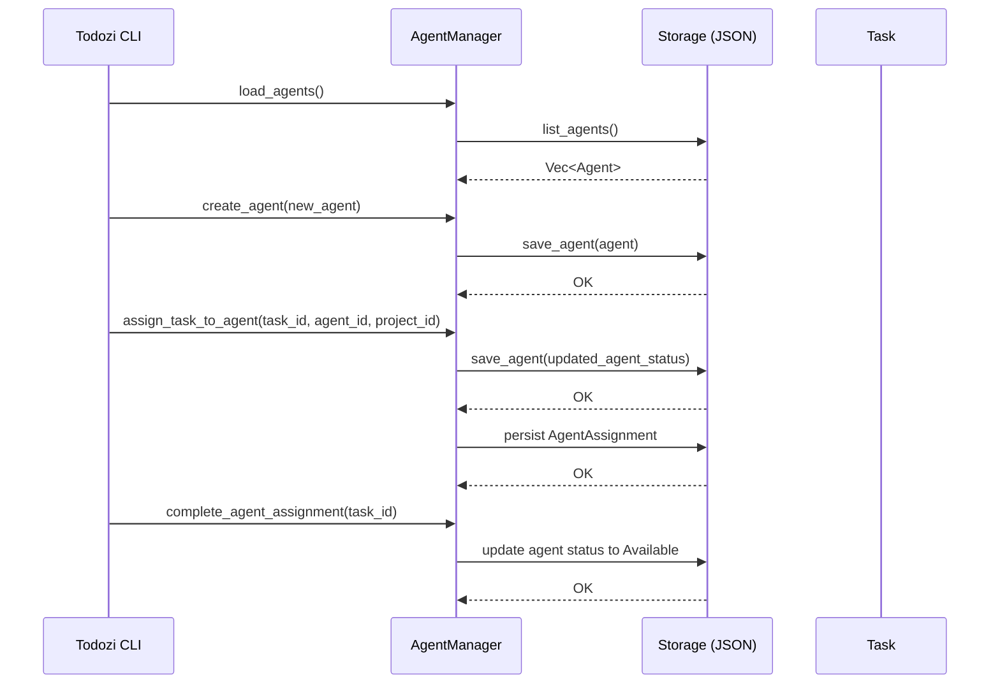

# `agent.rs` – Agent Management Overview

The **Agent** subsystem lives in `src/agent.rs` and provides the core logic for creating, loading, updating, deleting, and assigning AI agents to tasks.
Agents are the “workers” that carry out AI‑driven actions (coding, testing, planning, etc.) and can be queried for availability, capabilities, and specialization.

---

## High‑Level Responsibilities

| Responsibility | Description |
|----------------|--------------|
| **Agent Registry** | Keeps an in‑memory `HashMap<String, Agent>` keyed by a UUID. |
| **Persistence** | Loads agents from disk (`list_agents`) and writes new/updated agents via `save_agent`. |
| **Assignment Lifecycle** | Tracks `AgentAssignment` objects (who, what, when) and updates both the agent status (`Available ↔ Busy`) and assignment status (`Assigned → Completed`). |
| **Selection Logic** | Finds the “best” agent based on required specialization and optional capability preference. |
| **Statistics** | Supplies aggregate counts of agents by status and assignment completion rate. |

---

## Core Types

| Type | Purpose |
|------|---------|
| **`AgentManager`** | Owner of `agents` and `agent_assignments`. Provides async CRUD operations and helper queries. |
| **`Agent`** (in `models.rs`) | Holds configuration such as model provider/name, capabilities, specializations, tool list, and runtime metadata (`status`, timestamps). |
| **`AgentAssignment`** | Links an agent to a task and project, records assignment time and status (`Assigned`, `Completed`). |
| **`AgentUpdate`** | Builder pattern used for partial updates (name, description, capabilities, status, etc.). |
| **`AgentStatistics`** | Counters for total agents, available, busy, inactive, total assignments, completed assignments. Includes a `completion_rate()` helper. |

---

## Important Methods

| Method | Synopsis |
|--------|----------|
| `AgentManager::new()` | Initialise an empty manager. |
| `load_agents()` | Populate the manager from persisted JSON files; automatically creates default agents if none exist. |
| `create_agent(agent)` | Assign a UUID, timestamps, persist, and store in the manager. |
| `update_agent(agent_id, updates)` | Apply a `AgentUpdate` to a live agent and persist the changes. |
| `delete_agent(agent_id)` | Remove an agent from the in‑memory map (filesystem cleanup left to caller). |
| `assign_task_to_agent(task_id, agent_id, project_id)` | Verify agent availability, create an `AgentAssignment`, mark the agent **Busy**, and persist. |
| `complete_agent_assignment(task_id)` | Locate the matching assignment, mark it `Completed`, and set the agent back to **Available**. |
| `find_best_agent(required_specialization, preferred_capability)` | Filter for `Available` agents with the needed specialization; optionally prioritize those exposing a given capability. |
| `get_agent_assignments(agent_id)` / `get_task_assignments(task_id)` | Return slice views of the assignment list filtered by the specified ID. |
| `get_agent_statistics()` | Produce a `AgentStatistics` struct for UI/CLI reporting. |

---

## Interaction Flow Example

---

## Usage from the CLI

The CLI wrapper (`src/cli.rs`) forwards the following sub‑commands to `AgentManager`:

| CLI Sub‑command | Calls |
|-----------------|-------|
| `todozi agent list` | `AgentManager::get_all_agents()` |
| `todozi agent show <id>` | `AgentManager::get_agent(id)` |
| `todozi agent create …` | `AgentManager::create_agent()` |
| `todozi agent assign …` | `AgentManager::assign_task_to_agent()` |
| `todozi agent update …` | `AgentManager::update_agent()` |
| `todozi agent delete <id>` | `AgentManager::delete_agent()` |

---

## Extensibility Points

* **New Capabilities / Tools** – Extend `Agent::capabilities` or `Agent::tools` and adjust `find_best_agent` to weight them.
* **Persisted Assignment History** – Add a dedicated JSON file (or HLX collection) for long‑term audit logs.
* **Runtime Metrics** – Hook into `AgentStatistics` to expose Prometheus metrics via the server.

---

## Related Files

| File | Relationship |
|------|--------------|
| `src/models.rs` | Defines `Agent`, `AgentStatus`, `AgentAssignment`, and related enums. |
| `src/storage.rs` | Implements `save_agent`, `load_agent`, and `list_agents`. |
| `src/cli.rs` | Parses user‑facing commands and invokes `AgentManager`. |
| `src/server.rs` | Exposes REST endpoints for agent CRUD and assignment APIs. |
| `src/lib.rs` | Re‑exports `AgentManager` through the public `api` module. |

---

*This file provides a quick reference for developers new to the Agent subsystem, outlining its purpose, key data structures, and the most important API entry points.*
