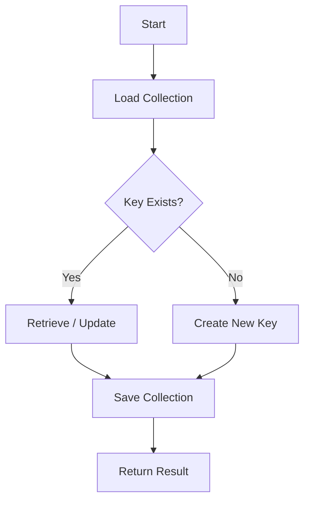

# `api.rs` – API Key Management Overview

## Purpose
The **API key module** provides a thin wrapper around the storage layer to create, persist, retrieve, and manage API keys used for authenticating clients of the Todozi server. It isolates all file‑IO concerns and exposes a simple API for the rest of the system.

## Core Types
| Type | Origin | Description |
|------|--------|-------------|
| `ApiKeyManager` | Defined in this file | Holds an in‑memory `ApiKeyCollection` and can be extended with higher‑level management logic. |
| `ApiKey` | `crate::models::ApiKey` | Represents a single API credential (public/private keys, user id, active flag). |
| `ApiKeyCollection` | `crate::models::ApiKeyCollection` | Container for many `ApiKey`s with helper methods for lookup, activation, and de‑activation. |
| `Result<T>` / `TodoziError` | `crate::error` | Standard error handling used throughout the module. |

## Public Functions
| Function | Signature | Description |
|----------|-----------|-------------|
| `save_api_key_collection` | `fn(&ApiKeyCollection) -> Result<()>` | Serialises the collection to JSON and writes it to `~/.todozi/api/api_keys.json`. |
| `load_api_key_collection` | `fn() -> Result<ApiKeyCollection>` | Reads the JSON file (if present) and deserialises it back into a collection. |
| `create_api_key` | `fn() -> Result<ApiKey>` | Generates a new random key, adds it to the persisted collection, and returns it. |
| `create_api_key_with_user_id` | `fn(String) -> Result<ApiKey>` | Same as `create_api_key` but ties the key to a specific `user_id`. |
| `get_api_key` | `fn(&str) -> Result<ApiKey>` | Retrieves a key by its internal `user_id`. |
| `get_api_key_by_public` | `fn(&str) -> Result<ApiKey>` | Retrieves a key by its public identifier. |
| `list_api_keys` | `fn() -> Result<Vec<ApiKey>>` | Returns **all** stored API keys. |
| `list_active_api_keys` | `fn() -> Result<Vec<ApiKey>>` | Returns only keys marked as active. |
| `check_api_key_auth` | `fn(&str, Option<&str>) -> Result<(String, bool)>` | Validates a public (and optional private) key, returning the associated `user_id` and an `is_admin` flag. |
| `deactivate_api_key` / `activate_api_key` | `fn(&str) -> Result<()>` | Toggle the active state of a key identified by `user_id`. |
| `remove_api_key` | `fn(&str) -> Result<ApiKey>` | Deletes a key from the collection and returns the removed key. |

## Typical Usage Flow

1. **Load** the collection from disk (`load_api_key_collection`).
2. **Create / Update** API keys via the public helpers.
3. **Persist** the updated collection back to the file system (`save_api_key_collection`).
4. **Authenticate** incoming requests using `check_api_key_auth`.

## Integration Points
* **`server.rs`** – Calls `check_api_key_auth` to guard HTTP‑like endpoints.
* **CLI (`cli.rs`)** – Exposes sub‑commands such as `api create`, `api list`, `api deactivate`.
* **Storage Layer** – Uses `storage::get_storage_dir()` to resolve the base directory (`~/.todozi`).

## Error Handling
All functions return `Result<T, TodoziError>`. Common error cases include:
* Missing or corrupted JSON file → `TodoziError::IOError`.
* Validation failures (e.g., duplicate user IDs, missing keys) → `TodoziError::ValidationError`.

## See Also
* **`models.rs`** – Definitions for `ApiKey` and `ApiKeyCollection`.
* **`storage.rs`** – Helper for locating the Todozi data directory.
* **`error.rs`** – Central error enum used throughout the project.

