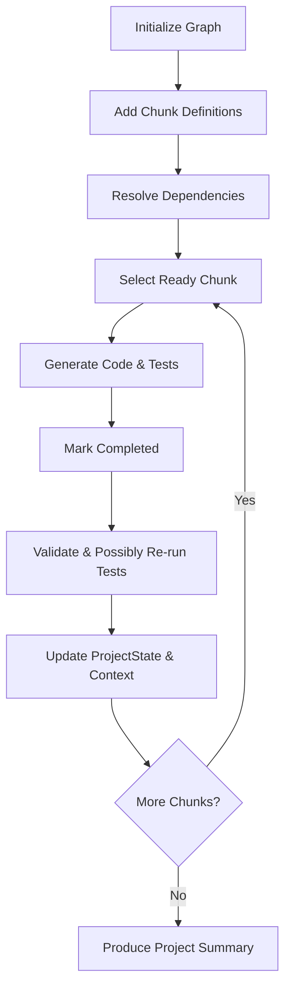

# Hierarchical Code Chunking System (`chunking.rs`)

## Purpose
`chunking.rs` implements a **structured code‑generation framework** that drives large‑scale AI‑assisted development.
It breaks a project into hierarchical **chunks** (project → module → class → method → block), tracks dependencies, and maintains contextual state, enabling agents to generate, test, and validate code incrementally.

## Core Types

| Type | Category | Description |
|------|----------|-------------|
| `ChunkingLevel` | Enum | Levels of granularity (`Project`, `Module`, `Class`, `Method`, `Block`). Provides token limits, human‑readable description, and examples. |
| `ChunkStatus` | Enum | Lifecycle of a chunk (`Pending`, `InProgress`, `Completed`, `Validated`, `Failed`). |
| `ProjectState` | Struct | Global project metrics (line counts, module tracking, dependencies, timestamps). |
| `ContextWindow` | Struct | Immediate coding context (previous/current class, imports, function signatures, error patterns). |
| `CodeChunk` | Struct | Represents a single chunk of code with status, dependencies, source, tests, and metadata. |
| `CodeGenerationGraph` | Struct | Central graph holding all `CodeChunk`s, plus the associated `ProjectState` and `ContextWindow`. Provides navigation and mutation helpers. |

## Key Methods & Behaviours

- **ChunkingLevel**
  - `max_tokens()`, `description()`, `example()`, `Display` impl.
- **ProjectState**
  - `new(max_lines)`, `add_completed_module`, `add_pending_module`,
    `set_global_variable`, `increment_lines`, `to_state_string`.
- **ContextWindow**
  - `new()`, `add_import`, `add_function_signature`,
    `add_error_pattern`, `set_current_class`, `to_context_string`.
- **CodeChunk**
  - `new(chunk_id, level)`, `add_dependency`, `set_code`,
    `set_tests`, `mark_completed`, `mark_validated`, `mark_failed`.
- **CodeGenerationGraph**
  - `new(max_lines)`, `add_chunk`, `get_ready_chunks`,
    `get_chunk / get_chunk_mut`, `update_chunk_code`,
    `update_chunk_tests`, `mark_chunk_completed`,
    `mark_chunk_validated`, `get_project_summary`,
    `get_next_chunk_to_work_on`, `get_chunks_by_level`.

## Typical Workflow (Mermaid)



1. **Initialize** a `CodeGenerationGraph` with a line‑limit.
2. **Add** chunks (`add_chunk`) specifying IDs, level, and dependencies.
3. The engine **detects ready chunks** (`get_ready_chunks`) whose dependencies are satisfied.
4. An agent **generates code** (`update_chunk_code`) and **tests** (`update_chunk_tests`).
5. After successful generation, the chunk is **marked completed** and optionally **validated**.
6. The `ProjectState` and `ContextWindow` are updated to inform subsequent chunks.
7. Loop until all chunks are processed, then call `get_project_summary` for a human‑readable overview.

## Integration Points

- **Agent System (`agent.rs`)** – Agents query the graph for the next chunk, invoke the appropriate tool (e.g., code executor), and feed results back.
- **CLI (`cli.rs`)** – Commands such as `todozi generate --project <name>` bootstrap a `CodeGenerationGraph`.
- **Server (`server.rs`)** – Exposes HTTP‑like endpoints to start/inspect a graph remotely.
- **Embedding Service (`emb.rs`)** – May provide semantic similarity for chunk naming or dependency inference.

## Persistence & Serialization

All structs derive `Serialize` / `Deserialize` via `serde`, allowing the entire graph to be saved to disk (e.g., as JSON or HLX) for checkpointing or later resumption.

## Example Snippet

```rust
use todozi::chunking::*;

let mut graph = CodeGenerationGraph::new(5000);

// Define modules and their dependencies
graph.add_chunk("mod_db".to_string(), ChunkingLevel::Module, vec![]);
graph.add_chunk(
    "class_connection".to_string(),
    ChunkingLevel::Class,
    vec!["mod_db".to_string()],
);
graph.add_chunk(
    "method_open".to_string(),
    ChunkingLevel::Method,
    vec!["class_connection".to_string()],
);

// Generate code for the first ready chunk
if let Some(chunk_id) = graph.get_next_chunk_to_work_on() {
    let code = "// generated Rust code".to_string();
    graph.update_chunk_code(&chunk_id, code).unwrap();
    graph.mark_chunk_completed(&chunk_id).unwrap();
}

// Print a summary
println!("{}", graph.get_project_summary());
```

## Future Extensions

- **Parallel Chunk Execution** – Leverage `ChunkStatus` with a task scheduler.
- **Versioned Graphs** – Snapshot the graph at each milestone for rollback.
- **Cross‑Project References** – Allow chunks to depend on artefacts from other graphs.

---

